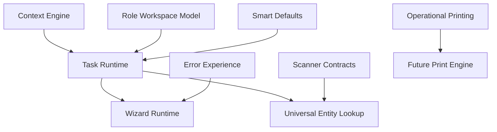

# Operator Experience Foundation

## Related Documents

- [UX Guidelines](../06-guidelines/UX_GUIDELINES.md)
- [Lookup Guidelines](../06-guidelines/LOOKUP_GUIDELINES.md)
- [Search Engine](SEARCH.md)

> **Note:** Canonical content lives here. Previous location: `docs/OPERATOR_EXPERIENCE_FOUNDATION.md`.

Sprint OX-01 introduces the Operator Experience Foundation as a platform capability. It is not a business module and it does not redesign existing business pages. Business apps should adopt it after approval.

## Architecture

OX sits above the platform engines and below business apps:

## Shared Runtime Contracts

The runtime contracts live in `src/platform/operator-experience/public-api.ts`.

- `OxTaskDefinition` describes task-first work such as Receive Goods or Daily Production.
- `OxOperationalContext` carries current company, branch, warehouse, line, shift, role, device, locale, and date.
- `OxLookupProviderContract` standardizes remote search, hydration, recent items, favorites, barcode search, QR search, async loading, and keyboard navigation.
- `OxScannerContract` defines scanner-first input targets without implementing scanner drivers.
- `OxSmartDefaultDefinition` defines where defaults come from and whether the operator must confirm them.
- `OxRoleWorkspaceDefinition` defines reusable role workspaces.
- `OxWizardDefinition` defines resumable guided task flows.
- `OxOperatorError` defines operator-safe errors that explain the problem, reason, and fix.
- `OxPrintDefinition` defines operational label readiness for future print execution.

## UX Runtime Components

Reusable components live in `src/shared/ui/operator-experience`.

- `OperatorTaskCard`
- `OperatorContextBar`
- `OperatorProgressiveSection`
- `ScannerInputFrame`
- `OperatorWizardProgress`
- `OperatorErrorMessage`
- `SmartDefaultsSummary`
- `OperatorMobileStandardsCard`

## Entity Lookup Architecture

OX lookup contracts forbid raw ID display. Options can keep internal IDs for persistence, but rendered options must have business names and may include business codes, subtitles, statuses, thumbnails, recent state, and favorite state. Manual UUID-like lookup terms are rejected before search.

Business apps should connect these contracts to platform Search providers and selected-record hydration providers.

## Context Engine

The context engine normalizes the active company, branch, warehouse, location, production line, workstation, shift, supervisor, role, device, locale, timezone, and transaction date. Apps inherit context and should ask for confirmation only when the default is uncertain.

## Role Workspace Model

Initial reusable templates are provided for Warehouse Keeper, Production Worker, and Production Supervisor. Additional roles should follow the same contract instead of creating bespoke dashboards.

## Wizard Model

Long processes should use `OxWizardDefinition` and `createOxWizardState` for step validation, progress, save draft, resume later, and review before submit.

## Scanner Integration

OX provides contracts for scanner targets and symbologies only. Hardware drivers, camera scanning, and native mobile scanning remain future integrations.

## Smart Defaults

Smart defaults resolve from context, role workspaces, recent activity, task definitions, system numbering, or business rules. Defaults preserve auditability by keeping source, confidence, and confirmation metadata.

## Mobile Standards

OX standards require large touch targets, one-handed operation, visible scanner input, single-column forms on handheld devices, minimal primary actions, and offline draft readiness.

## Error Experience

Operator errors must preserve input and avoid technical exception details. Every message should explain what is wrong, why it matters, and how to fix it.

## Printing Readiness

OX defines label contracts for product, shelf, location, serial, lot, work order, production, and transfer labels. Execution is delegated to the future Print Engine.

## Integration Points

- Platform Search for entity lookup and hydration.
- Platform Navigation and command palette for task-first quick actions.
- Platform Workflow for guided task lifecycle.
- Platform Feedback for operator-safe validation and result messages.
- Platform Printing for future label rendering.
- Platform Numbering for document and business code defaults.
- Platform Permissions for role-scoped task visibility.

## Risks

- Existing business pages still need explicit adoption before users benefit.
- Lookup providers need remote search and hydration implementations per entity.
- Scanner contracts need web/hardware integration later.
- Print definitions are readiness contracts until Print Engine execution is connected.
- Offline draft support needs persistence decisions beyond this foundation.

## Future Dependencies

- Runtime record search indexes.
- Print Engine execution.
- Device-aware shell policies.
- Business app task mappings.
- Entity-specific quick create contracts.
- Offline draft storage and replay.
