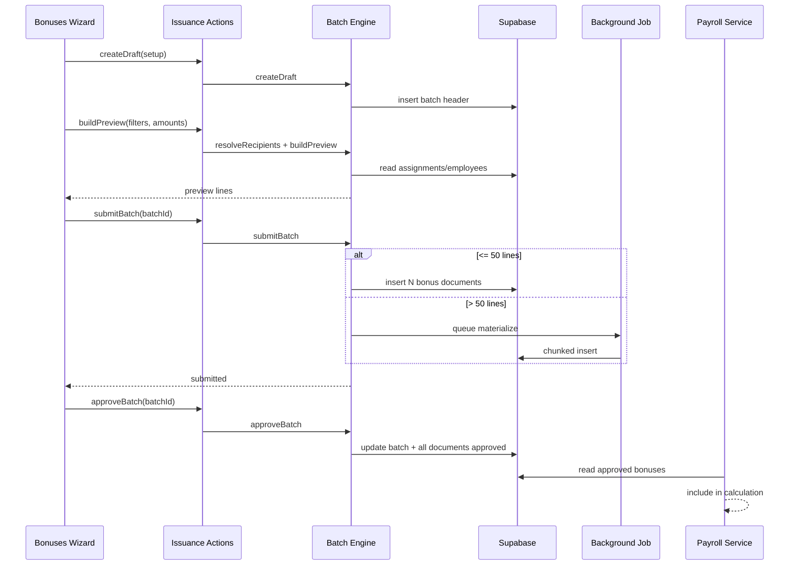

# Nexora HCM — Compensation Batch Issuance Engine

**Status:** Approved for Implementation  
**Version:** 1.0  
**Date:** 2026-07-09  
**Scope:** Bulk issuance of employee financial documents (bonuses, incentives, penalties)  
**Authority:** Complements [HR & Payroll Architecture Freeze v1.0](../01-platform/HR_PAYROLL_ARCHITECTURE_FREEZE_V1.md)

---

## Executive Summary

HR financial pages (Bonuses, Incentives, Penalties) currently support **one employee per form submission**. Operations teams need to issue **1–500+ documents in one controlled batch** — e.g. Eid bonus by position, spot awards with different amounts, or department-wide incentives — with preview, approval, audit, and payroll consumption unchanged.

**Solution:** Introduce `HrCompensationIssuanceBatchEngine` as a reusable platform capability. Each batch creates **individual employee documents** (existing tables) linked to a **batch header** (new table). UI uses an **OxWizard** launched from list workspaces.

---

## Table of Contents

1. [Goal](#1-goal)
2. [Current State](#2-current-state)
3. [Users & Roles](#3-users--roles)
4. [Business Workflow](#4-business-workflow)
5. [Architecture Decision](#5-architecture-decision)
6. [Database Design](#6-database-design)
7. [Service Contracts](#7-service-contracts)
8. [Selection & Amount Rules](#8-selection--amount-rules)
9. [UI/UX Design](#9-uiux-design)
10. [Permissions & RLS](#10-permissions--rls)
11. [Payroll Integration](#11-payroll-integration)
12. [Background Jobs & Scale](#12-background-jobs--scale)
13. [Import / Export](#13-import--export)
14. [Risks](#14-risks)
15. [Implementation Sprints](#15-implementation-sprints)
16. [File Map](#16-file-map)
17. [Test Matrix](#17-test-matrix)
18. [Verification Checklist](#18-verification-checklist)
19. [Done Criteria](#19-done-criteria)

---

## 1. Goal

Enable HR/compensation operators to:

| Capability | Example |
|------------|---------|
| Fixed amount for a group | All active employees → 1,000 SAR Eid bonus |
| Amount by position | Accountants = 500, Drivers = 300 |
| Custom amount per employee | Manager 3,000, Staff 1,000 (editable grid) |
| Mixed selection | 2 manual + 100 by position + full branch |
| Single approval surface | Approve/reject entire batch or selected lines |
| Full traceability | Batch code, creator, audit, payroll period link |

**Out of scope (v1):** formula-based amounts (% of basic salary), advances/loans batch, retroactive payroll auto-posting.

---

## 2. Current State

### What exists

| Area | Location | Notes |
|------|----------|-------|
| Single-record bonus form | `hr-bonuses-workspace.tsx` | `createEmployeeBonusAction` |
| Single-record incentive form | `hr-incentives-workspace.tsx` | `createEmployeeIncentiveAction` |
| Single-record penalty form | `hr-penalties-workspace.tsx` | `createEmployeePenaltyAction` |
| Financial tables | `20260713120000_hr_employee_financial_services_foundation.sql` | `metadata jsonb` on each row |
| Payroll consumption | `hr-payroll-calculation.service.ts` | Reads approved bonuses/incentives/penalties |
| Position lookup | `hr.positions.lookup` | `hr_positions` + assignments |
| Assignment resolver | `hr-assignment-resolver.service.ts` | Primary position per employee |
| Batch pattern reference | `hr-attendance-payroll-export.service.ts` | Header + lines + background job |
| Wizard runtime | `OxWizardDefinition` | Inventory, purchasing, manufacturing |

### Gaps

- No batch header entity for financial issuance
- No `batch_id` link on bonus/incentive/penalty rows
- No employee resolution by position/department filters at scale
- No preview-before-commit for multi-employee amounts
- No bulk approve/reject for financial documents
- `HR_BULK_OPERATION_DEFINITIONS` has no financial module entries

---

## 3. Users & Roles

| Role | Actions |
|------|---------|
| Compensation viewer | View batches, lines, individual documents |
| Compensation manager | Create batch, preview, submit, approve/reject batch |
| Payroll operator | View approved batches linked to payroll period |
| Auditor | Read batch audit trail |

Permissions (existing):

- `hr.compensation.view` — read
- `hr.compensation.manage` — create/submit/approve

---

## 4. Business Workflow

```text
┌─────────────┐    ┌──────────────┐    ┌─────────────┐    ┌──────────────┐
│ Define batch│───▶│ Preview lines│───▶│ Submit batch│───▶│ Approve batch│
│ type+filters│    │ edit amounts │    │ (N documents)│    │ (all lines)  │
└─────────────┘    └──────────────┘    └─────────────┘    └──────────────┘
                                              │                    │
                                              ▼                    ▼
                                        status=submitted     status=approved
                                        per employee doc     payroll-ready
```

### Status machine — Batch

| Status | Meaning |
|--------|---------|
| `draft` | Wizard in progress; lines editable |
| `preview_ready` | Preview computed; awaiting operator confirm |
| `processing` | Background job inserting documents |
| `submitted` | All lines created; pending approval |
| `approved` | All lines approved |
| `partially_approved` | Mixed (future: line-level approval) |
| `rejected` | Batch rejected; lines cancelled |
| `failed` | Processing error; partial insert rolled back |

### Status machine — Lines (v1 mirrors parent)

On submit: each employee document inserted with `status = submitted`.  
On batch approve: update all linked documents to `approved`.  
On batch reject: update all linked documents to `rejected`.

---

## 5. Architecture Decision

### ADR: Reusable engine, not three duplicate features

**Decision:** One engine (`HrCompensationIssuanceBatchEngine`) with `documentKind` discriminator:

```typescript
type HrCompensationIssuanceDocumentKind = "bonus" | "incentive" | "penalty";
```

**Rationale:**

- Bonuses, incentives, penalties share: selection, amount distribution, preview, batch approval, audit
- Payroll already treats bonuses + incentives as earnings; penalties as deductions
- Extends without touching payroll calculation loop

### ADR: Individual documents remain source of truth

**Decision:** Batch does not replace `hr_employee_bonuses` / `incentives` / `penalties`. It **generates** them.

**Rationale:**

- Payroll runtime unchanged
- Employee profile tabs unchanged
- Per-employee approval history preserved
- Batch is grouping + operational convenience

### ADR: OxWizard for issuance UX

**Decision:** Multi-step wizard per constitution § Surface Selection.

**Rationale:**

- 4-step flow is operational, not a simple modal
- Matches attendance export and inventory transaction patterns

---

## 6. Database Design

### Migration: `20260709120000_hr_compensation_issuance_batches.sql`

#### Table: `hr_compensation_issuance_batches`

```sql
create table hr_compensation_issuance_batches (
  id                uuid primary key default gen_random_uuid(),
  tenant_id         uuid not null,
  company_id        uuid not null,
  branch_id         uuid,
  batch_code        text not null,           -- e.g. BON-BATCH-2026-00042
  document_kind     text not null,           -- bonus | incentive | penalty
  document_subtype  text not null,           -- bonus_type / incentive_type / penalty_type
  status            text not null default 'draft',
  effective_date    date not null,
  payroll_period    text,
  reason            text,
  notes             text,
  selection_mode    text not null,           -- see §8
  selection_filters jsonb not null default '{}',
  amount_mode       text not null,           -- fixed | by_position | per_employee
  amount_config     jsonb not null default '{}',
  employee_count    int not null default 0,
  total_amount      numeric(18,2) not null default 0,
  currency_code     text not null default 'SAR',
  submitted_at      timestamptz,
  submitted_by      uuid,
  approved_at       timestamptz,
  approved_by       uuid,
  rejected_at       timestamptz,
  rejected_by       uuid,
  rejection_reason  text,
  processing_error  text,
  metadata          jsonb not null default '{}',
  created_by        uuid not null,
  updated_by        uuid not null,
  created_at        timestamptz not null default now(),
  updated_at        timestamptz not null default now(),
  deleted_at        timestamptz,
  deleted_by        uuid,
  unique (tenant_id, company_id, batch_code)
);
```

Indexes:

- `(tenant_id, company_id, status, created_at desc)`
- `(tenant_id, document_kind, status)`

#### Table: `hr_compensation_issuance_batch_lines` (staging / preview)

```sql
create table hr_compensation_issuance_batch_lines (
  id                uuid primary key default gen_random_uuid(),
  tenant_id         uuid not null,
  batch_id          uuid not null references hr_compensation_issuance_batches(id) on delete cascade,
  employee_id       uuid not null,
  position_id       uuid,
  position_label    text,
  amount            numeric(18,2),
  percentage        numeric(8,4),          -- incentives only
  currency_code     text not null default 'SAR',
  line_status       text not null default 'pending',  -- pending | created | skipped | error
  target_document_id uuid,                 -- FK to created bonus/incentive/penalty
  target_document_number text,
  skip_reason       text,
  metadata          jsonb not null default '{}',
  created_at        timestamptz not null default now(),
  updated_at        timestamptz not null default now(),
  unique (batch_id, employee_id)
);
```

#### Alter existing document tables

Add nullable `batch_id uuid references hr_compensation_issuance_batches(id)` to:

- `hr_employee_bonuses`
- `hr_employee_incentives`
- `hr_employee_penalties`

Index: `(tenant_id, batch_id)` on each.

RLS: same tenant isolation pattern as parent tables.

---

## 7. Service Contracts

### File: `hr-compensation-issuance-batch.service.ts`

```typescript
class HrCompensationIssuanceBatchService {
  // Step 1 — create draft batch shell
  createDraft(input: CreateIssuanceBatchInput): Promise<{ batchId: string; batchCode: string }>;

  // Step 2 — resolve employees from filters
  resolveRecipients(batchId: string): Promise<IssuanceRecipientPreview[]>;

  // Step 3 — compute amounts (fixed / by_position / per_employee overrides)
  buildPreview(batchId: string, overrides?: PerEmployeeAmountOverride[]): Promise<IssuanceBatchPreview>;

  // Step 4 — persist lines to staging table
  savePreviewLines(batchId: string, lines: IssuanceBatchLineInput[]): Promise<void>;

  // Step 5 — materialize N employee documents
  submitBatch(batchId: string): Promise<{ createdCount: number; skippedCount: number }>;

  // Approval
  approveBatch(batchId: string): Promise<void>;
  rejectBatch(batchId: string, reason: string): Promise<void>;

  // Read
  getBatch(batchId: string): Promise<IssuanceBatchDetail>;
  listBatches(filters: IssuanceBatchListFilters): Promise<PaginatedIssuanceBatches>;
}
```

### Supporting service: `hr-compensation-recipient-resolver.service.ts`

Resolves employee IDs from:

- Explicit `employeeIds[]`
- `positionIds[]` (via active primary assignment as of `effectiveDate`)
- `departmentIds[]`, `branchIds[]`, `payrollGroupIds[]`
- `employmentStatus[]` (default: `active`)
- Exclusions: `excludeEmployeeIds[]`

Uses `HrAssignmentResolverService` for position match; query pattern from `hr-attendance-payroll-export.service.ts` employee resolution.

### Schemas: `hr-compensation-issuance-batch.schema.ts`

Zod schemas for all inputs; max 2,000 lines per batch (configurable).

### Actions: `hr-compensation-issuance.actions.ts`

Server actions wrapping service with `requirePermission(compensationManage)` and `revalidatePath`.

### API routes (optional, for large preview):

- `POST /api/hr/compensation-issuance/preview`
- `POST /api/hr/compensation-issuance/submit`

Use when preview grid exceeds server-action payload limits.

---

## 8. Selection & Amount Rules

### Selection modes

| Mode | `selection_mode` | Filters |
|------|------------------|---------|
| Manual employees | `manual` | `employeeIds` |
| By position | `by_position` | `positionIds` |
| By department | `by_department` | `departmentIds` |
| By branch | `by_branch` | `branchIds` |
| All active | `all_active` | company scope |
| Import file | `import` | parsed rows from Excel |

Multiple filters combine with **AND**; within array **OR** (e.g. position A OR position B).

### Amount modes

| Mode | `amount_mode` | Config |
|------|---------------|--------|
| Fixed for all | `fixed` | `{ amount: 1000 }` |
| By position | `by_position` | `{ "position_uuid": 500, "position_uuid_2": 300 }` |
| Per employee | `per_employee` | lines table or import |
| Percentage (v2) | `percentage` | deferred |

### Validation rules

- Amount > 0 for bonuses; incentives allow amount OR percentage (existing rule)
- Penalties require `description` at batch level propagated to each document
- Skip employees without active employment profile (line `skipped` + reason)
- Skip duplicate pending document same type+period (configurable warn vs block)
- `HrPayrollPeriodLifecycleService.assertPayrollDateRangeAllowsMutation` on effective date

### Document number generation

Reuse `nextDocNumber("BON")` / `"INC"` / `"PEN"` per line on materialize.  
Batch code: `BON-BATCH-YYYY-#####` / `INC-BATCH-...` / `PEN-BATCH-...`.

---

## 9. UI/UX Design

### Entry points

Each financial list workspace gets:

1. **Primary CTA:** `إصدار جماعي` / `Bulk issuance` → opens wizard (`?batch=create` or dedicated route)
2. **Secondary:** keep existing single-employee quick form (collapsed or "إضافة فردية")

Routes:

- `/erp/hr/bonuses?batch=create` — wizard overlay on bonuses list
- `/erp/hr/bonuses/batches/[id]` — batch detail (read + approve)

Same pattern for incentives and penalties.

### Wizard steps (`defineOxWizard`)

| Step | Key | Content |
|------|-----|---------|
| 1 | `setup` | Document kind (pre-filled), subtype select, effective date, payroll period, reason |
| 2 | `recipients` | Selection mode tabs; EntityLookup multi for positions/departments; employee multi-select |
| 3 | `amounts` | Mode selector; fixed input OR position amount grid OR editable `EnterpriseDataTable` |
| 4 | `review` | Summary KPIs: count, total SAR, warnings; Confirm → submit |

### Batch list panel

On bonuses page — second tab or filter group:

- Batch code, kind, count, total, status, created by, actions (view, approve, reject)

### Platform components (mandatory)

- `PageContainer`, `PageHeader`, `RecordFormDialog` (not for wizard)
- `EntityLookup` — positions, departments, employees
- `DatePicker` — effective date
- `EnterpriseDataTable` — preview lines + main list
- `platform.feedback` — toasts
- Dark mode + RTL verified

### i18n keys

Add under `hr.compensationIssuance.*` in locale files (ar + en).

---

## 10. Permissions & RLS

| Operation | Permission | Server enforcement |
|-----------|------------|-------------------|
| View batches | `hr.compensation.view` | loader + RLS |
| Create/submit | `hr.compensation.manage` | action + RLS |
| Approve/reject | `hr.compensation.manage` | action; optional future `hr.actions.approve` |
| Export batch | `hr.import-export.manage` | export action |

RLS policies on new tables: `tenant_id = auth.jwt()->>'tenant_id'`.

Audit events:

- `hr.compensation.batch.created`
- `hr.compensation.batch.submitted`
- `hr.compensation.batch.approved`
- `hr.compensation.batch.rejected`
- `hr.compensation.batch.failed`

---

## 11. Payroll Integration

**No change to calculation engine.**

Existing flow in `HrPayrollCalculationService`:

- Reads `hr_employee_bonuses` where `status = approved`
- Reads `hr_employee_incentives` where `status = approved`
- Reads `hr_employee_penalties` where `status = approved`

Batch-created documents use same statuses. Optional: set `payroll_period` on batch to propagate to all lines.

Payroll readiness workspace can later show "pending batch approvals" KPI.

---

## 12. Background Jobs & Scale

| Threshold | Behavior |
|-----------|----------|
| ≤ 50 employees | Synchronous submit in server action |
| > 50 employees | Queue `hr.compensation-issuance-materialize` job |

Job flow:

1. Set batch `status = processing`
2. Insert documents in chunks of 50 (transaction per chunk)
3. Update lines with `target_document_id`
4. Set batch `status = submitted` or `failed` with `processing_error`

Idempotency key: `issuance-materialize:{batchId}`.

Register job in `app.manifest.ts` automation entries.

---

## 13. Import / Export

### Import template (v1.1)

Excel columns:

| employee_number | amount | notes |
|-----------------|--------|-------|

Route: `GET /api/hr/compensation-issuance/import-template`

Parser reuses pattern from `hr-zkteco-csv-import.ts` / employees import.

### Export

Export batch lines + created document numbers for audit.

Add to `HR_BULK_OPERATION_DEFINITIONS.financial`:

- `bulk_issue_bonus`
- `bulk_issue_incentive`
- `bulk_issue_penalty`
- `export_batch`

---

## 14. Risks

| Risk | Mitigation |
|------|------------|
| 500+ insert timeout | Background job + chunking |
| Wrong position filter | Preview step mandatory; show position column |
| Duplicate Eid bonus same year | Validation rule + warn in preview |
| Partial failure mid-batch | Chunk transactions; `failed` status; no orphan docs |
| Payroll period locked | `HrPayrollPeriodLifecycleService` guard |
| UX overload on bonuses page | Wizard overlay; batch tab secondary |

---

## 15. Implementation Sprints

### Sprint 1 — Foundation (3–4 days)

**Goal:** Engine + DB + preview API; no UI beyond internal test.

| # | Task |
|---|------|
| 1.1 | Migration: batch header, batch lines, `batch_id` on 3 document tables |
| 1.2 | Types + Zod schemas in `hr-compensation-issuance-batch.schema.ts` |
| 1.3 | `HrCompensationRecipientResolverService` |
| 1.4 | `HrCompensationIssuanceBatchService` (draft, preview, save lines) |
| 1.5 | Unit tests: recipient resolution, amount modes, validation |
| 1.6 | Audit action constants |

**Exit:** `buildPreview()` returns correct lines for position filter in test DB.

---

### Sprint 2 — Bonuses UI + Submit (3–4 days)

**Goal:** End-to-end bulk Eid bonus from UI.

| # | Task |
|---|------|
| 2.1 | `hr-compensation-issuance.actions.ts` (create, preview, submit, approve, reject) |
| 2.2 | `hr-compensation-issuance-bonuses.wizard.tsx` (4 steps) |
| 2.3 | Update `hr-bonuses-workspace.tsx` — CTA + wizard launch + batch tab |
| 2.4 | `submitBatch` materialize → `hr_employee_bonuses` with `batch_id` |
| 2.5 | Batch detail page `/erp/hr/bonuses/batches/[id]` |
| 2.6 | Loader: list batches + enrich employee labels |
| 2.7 | i18n ar/en |

**Exit:** User issues 10-employee Eid bonus by position; approves batch; documents appear in table.

---

### Sprint 3 — Scale + Background Job (2 days)

**Goal:** 500-employee batch works reliably.

| # | Task |
|---|------|
| 3.1 | Background job handler `hr-compensation-issuance-materialize` |
| 3.2 | Chunked insert + progress metadata on batch |
| 3.3 | Processing/_failed UI states on batch detail |
| 3.4 | Integration test: 100-line batch |

**Exit:** 500-employee batch completes via job; all lines linked.

---

### Sprint 4 — Incentives + Penalties (2–3 days)

**Goal:** Same engine, two more workspaces.

| # | Task |
|---|------|
| 4.1 | Wizard variants for incentive (percentage column) and penalty (description, severity) |
| 4.2 | Wire `hr-incentives-workspace.tsx` and `hr-penalties-workspace.tsx` |
| 4.3 | Materialize to `hr_employee_incentives` / `hr_employee_penalties` |
| 4.4 | Batch list on each page |

**Exit:** Three financial modules support bulk issuance.

---

### Sprint 5 — Import + Polish (2 days)

**Goal:** Excel path + production hardening.

| # | Task |
|---|------|
| 5.1 | Import template + parse route |
| 5.2 | Wizard step: upload Excel → per_employee lines |
| 5.3 | Duplicate detection warning in preview |
| 5.4 | Update `HR_BULK_OPERATION_DEFINITIONS` + help content |
| 5.5 | Update `IMPLEMENTATION_STATUS.md` + UAT checklist row |

**Exit:** Import 200 rows from Excel → preview → submit → approve.

---

### Sprint 6 — UAT + Signoff (1–2 days)

| # | Task |
|---|------|
| 6.1 | Script: `scripts/hcm-uat-compensation-batch.mts` |
| 6.2 | Manual UAT scenarios (see §17) |
| 6.3 | `npm run lint && npm run typecheck && npm run test` |
| 6.4 | Update `HCM_UAT_E2E_CHECKLIST.md` |

---

## 16. File Map

### New files

```text
supabase/migrations/20260709120000_hr_compensation_issuance_batches.sql

src/features/hr/application/schemas/hr-compensation-issuance-batch.schema.ts
src/features/hr/application/constants/hr-compensation-issuance.constants.ts
src/features/hr/application/services/hr-compensation-recipient-resolver.service.ts
src/features/hr/application/services/hr-compensation-issuance-batch.service.ts
src/features/hr/routes/actions/hr-compensation-issuance.actions.ts
src/features/hr/routes/loaders/hr-compensation-issuance.loader.ts
src/features/hr/application/jobs/hr-compensation-issuance-materialize.job.ts

src/app/(erp)/erp/hr/_components/hr-compensation-issuance-wizard.tsx
src/app/(erp)/erp/hr/_components/hr-compensation-issuance-batch-panel.tsx
src/app/(erp)/erp/hr/_components/hr-compensation-issuance-preview-table.tsx
src/app/(erp)/erp/hr/bonuses/batches/[id]/page.tsx

src/app/api/hr/compensation-issuance/import-template/route.ts
src/app/api/hr/compensation-issuance/preview/route.ts  (if needed)

tests/features/hr/hr-compensation-issuance-batch.service.test.ts
scripts/hcm-uat-compensation-batch.mts
```

### Modified files

```text
src/app/(erp)/erp/hr/_components/hr-bonuses-workspace.tsx
src/app/(erp)/erp/hr/_components/hr-incentives-workspace.tsx
src/app/(erp)/erp/hr/_components/hr-penalties-workspace.tsx
src/app/(erp)/erp/hr/bonuses/page.tsx
src/features/hr/routes/actions/hr-financial.actions.ts  (extract nextDocNumber if shared)
src/features/hr/financial-services-foundation.ts  (batch types)
src/features/hr/hr-production-readiness-foundation.ts  (bulk ops)
src/features/hr/app.manifest.ts  (job registration)
src/features/hr/application/services/hr-payroll-calculation.service.ts  (no logic change; optional batch metadata in snapshot)
src/features/hr/application/hr-help-content.ts
```

---

## 17. Test Matrix

| # | Scenario | Expected |
|---|----------|----------|
| T1 | Fixed 1000 SAR, all active (10 employees) | 10 bonus docs, total 10,000 |
| T2 | By position: 2 positions, different amounts | Correct per-position amounts |
| T3 | Manual 3 employees, custom amounts | 3 docs with exact amounts |
| T4 | Employee without active profile | Line skipped with reason |
| T5 | Approve batch | All docs `approved` |
| T6 | Reject batch | All docs `rejected` |
| T7 | 100+ employees | Background job completes |
| T8 | Payroll period locked | Submit blocked with clear error |
| T9 | Viewer role | Cannot submit; can view batch |
| T10 | Approved batch in payroll run | Bonuses included in calculation |
| T11 | Excel import 50 rows | Preview matches file |
| T12 | RTL + dark mode wizard | Readable forms and table |

---

## 18. Verification Checklist

```bash
npm run lint
npm run typecheck
npm run test -- hr-compensation-issuance
npx tsx scripts/hcm-uat-compensation-batch.mts
```

Manual:

1. `/erp/hr/bonuses` → Bulk issuance → Eid → by position → 500 SAR → preview → submit
2. Approve batch from batch detail
3. Open employee profile → verify bonus document
4. Run payroll readiness / calculation for period → verify amount included
5. Repeat quick smoke on incentives and penalties

---

## 19. Done Criteria

- [ ] Bulk issuance works for bonuses, incentives, penalties
- [ ] Fixed, by-position, and per-employee amount modes implemented
- [ ] Preview shows employee, position, amount before commit
- [ ] Batch approve/reject updates all linked documents
- [ ] 500-employee batch succeeds via background job
- [ ] RLS + permissions enforced server-side
- [ ] Audit events written for batch lifecycle
- [ ] Payroll calculation unchanged and consumes approved docs
- [ ] Platform UX: EntityLookup, DatePicker, EnterpriseDataTable, platform.feedback
- [ ] ar/en i18n complete
- [ ] UAT script + checklist updated
- [ ] No regression on single-employee create flow

---

## Appendix A — Sequence Diagram



---

## Appendix B — Cursor Implementation Prompt (Sprint 1)

```md
You are working inside nexora-erp.

## Goal
Implement Sprint 1 of docs/03-architecture/HCM_COMPENSATION_BATCH_ISSUANCE_ENGINE.md

## Start with
1. Migration file
2. Schema + constants
3. HrCompensationRecipientResolverService
4. HrCompensationIssuanceBatchService (draft + preview only)
5. Unit tests

## Constraints
- Do not change payroll calculation logic
- Reuse HrAssignmentResolverService patterns
- Tenant isolation on all tables
- requirePermission compensationManage on mutations

## Verify
npm run typecheck && npm run test -- hr-compensation-issuance
```
