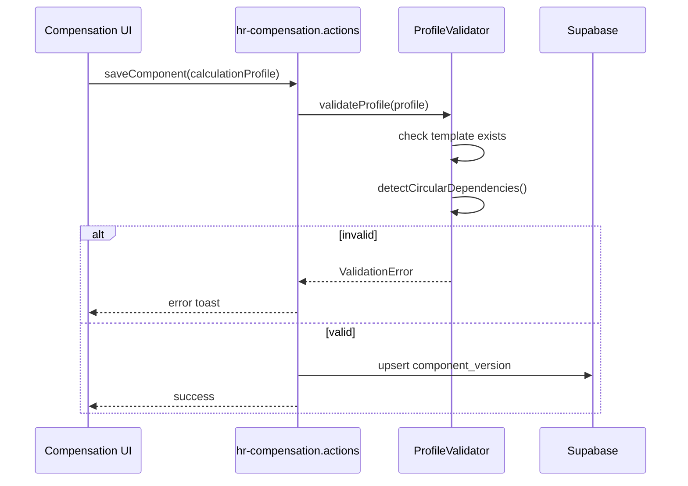
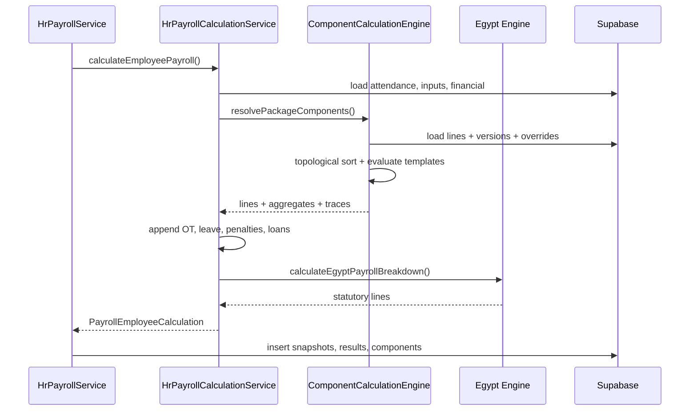

# Nexora HCM — Enterprise Payroll Component Calculation Engine

**Status:** Architecture Review (Planning)  
**Version:** 1.1  
**Date:** 2026-07-09  
**Last Updated:** 2026-07-09 (Sections 25–28, MVP decisions, test matrix)  
**Scope:** Compensation component calculation — extension only  
**Authority:** Complements [HR & Payroll Architecture Freeze v1.0](../01-platform/HR_PAYROLL_ARCHITECTURE_FREEZE_V1.md)

> **Constraint:** No runtime, migration, or Egypt Engine changes until sprint approval.  
> This document is the execution blueprint after sign-off.

---

## Table of Contents

1. [Current State Analysis](#1-current-state-analysis)
2. [Enterprise Design Proposal](#2-enterprise-design-proposal)
3. [Calculation Methods](#3-calculation-methods)
4. [Formula Templates](#4-formula-templates)
5. [Component Dependencies](#5-component-dependencies)
6. [Calculation Order Engine](#6-calculation-order-engine)
7. [Database Design (Proposal)](#7-database-design-proposal)
8. [Backward Compatibility](#8-backward-compatibility)
9. [UI/UX Proposal](#9-uiux-proposal)
10. [Payroll Runtime Integration](#10-payroll-runtime-integration)
11. [Localization (Egypt Engine)](#11-localization-egypt-engine)
12. [Future Expansion](#12-future-expansion)
13. [Performance](#13-performance)
14. [Risks](#14-risks)
15. [Implementation Plan (Sprints)](#15-implementation-plan-sprints)
16. [Architecture Freeze Alignment](#16-architecture-freeze-alignment)
17. [Service Contracts](#17-service-contracts)
18. [Sequence Diagrams](#18-sequence-diagrams)
19. [Test Matrix](#19-test-matrix)
20. [Migration Runbook (Design Only)](#20-migration-runbook-design-only)
21. [MVP Decisions (Recommended)](#21-mvp-decisions-recommended)
22. [Standard Component Catalog](#22-standard-component-catalog)
23. [Error Handling & Edge Cases](#23-error-handling--edge-cases)
24. [Snapshot Contract Extension](#24-snapshot-contract-extension)
25. [Payroll Component Dependency Engine](#25--payroll-component-dependency-engine)
26. [Formula Template Registry](#26--formula-template-registry)
27. [Enterprise Extension Points](#27--enterprise-extension-points)
28. [Architecture Decisions (ADR)](#28--architecture-decisions-adr)

---

## Executive Summary

Nexora has **enterprise-ready foundations** (versioned compensation, payroll snapshots, result components, calculation rules schema, localization packs) but the **live MVP runtime** is a ~260-line procedural loop in `HrPayrollCalculationService` that reads `amount_override` only.

**Proposed path:** Introduce `HrPayrollComponentCalculationEngine` as a **Compensation-domain extension** that replaces only the package-line resolution loop. All downstream artifacts (`PayrollCalculationLine[]`, snapshots, results, payslips, WPS) remain unchanged.

---

## 1. Current State Analysis

### 1.1 Data Model

```text
hr_compensation_categories
  └── hr_compensation_components (code, name)
        └── hr_compensation_component_versions
              ├── fixed_or_formula: 'fixed' | 'formula'
              ├── default_amount, default_rate
              ├── formula_metadata (runtime_evaluation_implemented: false)
              └── flags: taxable, insurable, included_in_gross_salary, ...

hr_salary_packages → hr_salary_package_versions
  └── hr_salary_package_lines
        ├── amount_override, rate_override
        └── formula_metadata_override

hr_employment_profiles.salary_package_ref → package version UUID
```

**Payroll runtime chain (frozen — do not change):**

```text
hr_payroll_runs
  → hr_payroll_employee_snapshots
  → hr_payroll_results
  → hr_payroll_result_components
  → hr_payslips + hr_payslip_lines
```

**Calculation engine tables (foundation only — not executed today):**

- `hr_payroll_calculation_rule_sets`
- `hr_payroll_calculation_rules` — `formula_type`, `formula_key`, `depends_on_component_codes[]`
- `hr_payroll_calculation_executions` + `hr_payroll_calculation_traces`

### 1.2 How Components Are Calculated Today

| Source | Code | Logic |
|--------|------|-------|
| Package lines | `BASIC`, `HOUSING`, … | `amount = amount_override ?? 0` — **fixed only** |
| Overtime | `OT-PAY` | `hours × (basic/30/8) × 1.25` + payroll inputs |
| Bonuses | `BONUS` | Sum bonuses/incentives/inputs |
| Unpaid leave | `UNPAID-LEAVE` | `unpaidDays × dailyRate` |
| Late/Early | `LATE-DED` | `minutes × minuteRate` |
| Penalties | `PENALTY` | Sum penalties |
| Loans/Advances | `LOAN`, `ADVANCE` | Monthly installments |
| Egypt statutory | `EG-SI-EE`, `EG-TAX`, `EG-SI-ER` | `calculateEgyptPayrollBreakdown()` |

**Key runtime file:** `src/features/hr/application/services/hr-payroll-calculation.service.ts`

Package loop (lines 356–378): reads `amount_override`, skips zero amounts, accumulates `basicSalary` and `grossEarnings` from flags.

### 1.3 Storage Locations

| Data | Table/Field |
|------|-------------|
| Component definition | `hr_compensation_component_versions` |
| Package amount | `hr_salary_package_lines.amount_override` |
| Calculated result | `hr_payroll_result_components` |
| Payslip line | `hr_payslip_lines.amount_metadata` |
| Snapshot | `hr_payroll_employee_snapshots.salary_components` |

### 1.4 Fixed-Amount-Only Reality

- Runtime ignores `default_amount`, `default_rate`, `formula_metadata`
- UI always inserts `fixed_or_formula: "fixed"`
- **No UI for package lines** — operational gap
- `hr_employee_compensation_overrides` exists but unused
- Contract placeholder `{{salary}}` reads first package line `amount_override` only

### 1.5 Impact Surface

| Layer | Impact |
|-------|--------|
| Compensation schema | Add calculation method fields |
| Compensation UI | Package line editor + method selector |
| Component resolver | **New engine** |
| `HrPayrollCalculationService` | Replace package loop only |
| Payroll Runtime / Egypt / Results / WPS | **No change** |

---

## 2. Enterprise Design Proposal

### 2.1 Architecture Layers

```text
┌─────────────────────────────────────────────────────────────┐
│              Payroll Runtime (UNCHANGED)                     │
│  HrPayrollService → snapshots → results → publish → WPS     │
└──────────────────────────┬──────────────────────────────────┘
                           │ PayrollCalculationLine[]
┌──────────────────────────▼──────────────────────────────────┐
│     HrPayrollCalculationService (MINIMAL CHANGE)             │
│  • Load inputs (attendance, financial, payroll_inputs)      │
│  • Call ComponentCalculationEngine.resolvePackageLines()      │
│  • Append variable components (OT, leave, …) — unchanged    │
│  • Call Egypt breakdown — unchanged                         │
└──────────────────────────┬──────────────────────────────────┘
                           │
┌──────────────────────────▼──────────────────────────────────┐
│     NEW: HrPayrollComponentCalculationEngine                   │
│  • Resolve definitions (version + line + employee overrides)  │
│  • Build dependency graph → topological sort                │
│  • Phased calculation via formula template evaluators       │
│  • Produce amounts + trace metadata                         │
└──────────────────────────┬──────────────────────────────────┘
                           │
┌──────────────────────────▼──────────────────────────────────┐
│         Compensation Configuration (EXTENDED)                │
│  Component version: calculation_method + parameters           │
│  Package line: parameter overrides                            │
│  Formula Template Registry (platform catalog)                 │
└─────────────────────────────────────────────────────────────┘
```

### 2.2 Component Calculation Profile

```typescript
type HrComponentCalculationMethod =
  | "fixed_amount"
  | "percentage"
  | "formula_template";

type HrComponentCalculationProfile = {
  method: HrComponentCalculationMethod;
  fixedAmount?: number;
  percentageBase?: "basic" | "gross" | "insurable_salary" | "component";
  percentageValue?: number;
  percentageComponentCode?: string;
  formulaTemplateKey?: string;
  formulaParameters?: Record<string, unknown>;
  dependsOnComponentCodes: string[];
  calculationSequence: number;
  roundingRule: HrCompensationRoundingRule;
};
```

### 2.3 Override Resolution Hierarchy

```text
1. Employee override (hr_employee_compensation_overrides) — Phase 2
2. Package line override
3. Component version default
4. Legacy: amount_override → fixed_amount
```

### 2.4 Contract Preservation

- Existing `fixed_or_formula = 'fixed'` + `amount_override` → unchanged behavior
- New fields nullable — absence means legacy fixed path
- Output contract `PayrollCalculationLine[]` unchanged

---

## 3. Calculation Methods

### 3.1 Method → Template Mapping

| Business Method | Template Key | Parameters |
|-----------------|--------------|------------|
| Fixed Amount | `fixed_amount` | `amount` |
| % of Basic | `percentage_of_base` | `base: "basic"`, `rate` |
| % of Gross | `percentage_of_base` | `base: "gross"`, `rate` |
| % of Insurable | `percentage_of_base` | `base: "insurable_salary"`, `rate` |
| % of Component | `percentage_of_component` | `componentCode`, `rate` |
| Daily Rate × Days | `daily_rate_times_days` | `daysSource` |
| Hours × Rate | `rate_times_quantity` | `quantitySource: "hours"`, `rate` |
| Units × Rate | `rate_times_quantity` | `quantitySource: "units"`, `rate` |
| Years × Rate | `rate_times_quantity` | `quantitySource: "years"`, `rate` |
| Basic ÷ 30 × Days | `prorated_basic` | `days`, `divisor: 30` |

### 3.2 Quantity Sources

```typescript
type HrCalculationQuantitySource =
  | "snapshot.worked_days"
  | "snapshot.worked_hours"
  | "snapshot.overtime_hours"
  | "snapshot.unpaid_days"
  | "snapshot.deduction_minutes"
  | "input.days"
  | "input.hours"
  | "input.units"
  | "input.years"
  | "literal";
```

### 3.3 Domain Separation

| Domain | Owner | Examples |
|--------|-------|----------|
| Compensation | Component Engine | BASIC, HOUSING, TRANSPORT |
| Variable inputs | Attendance / Payroll Inputs | OT-PAY, UNPAID-LEAVE |
| Statutory | Localization Pack (Egypt) | EG-SI-EE, EG-TAX, EG-SI-ER |

Tax and insurance **remain statutory** — not compensation components in MVP.

---

## 4. Formula Templates

### 4.1 MVP Template Registry

| Key | Label | Depends On | Phase |
|-----|-------|------------|-------|
| `fixed_amount` | Fixed Amount | — | A |
| `percentage_of_base` | Percentage of Base | aggregates | B/C |
| `percentage_of_component` | Percentage of Component | components | B |
| `daily_rate_times_days` | Daily Rate × Days | basic + snapshot | B |
| `rate_times_quantity` | Rate × Quantity | optional basic | B |
| `prorated_basic` | Prorated Basic | basic | B |

**MVP storage:** TypeScript constants in `hr-payroll-formula-templates.ts` (no DB table in Sprint 1).

**Phase 2:** Optional `hr_payroll_formula_templates` admin table.

### 4.2 Template Evaluator Contract

```typescript
type FormulaTemplateEvaluator = (
  context: PayrollCalculationContext,
  params: Record<string, unknown>,
) => FormulaEvaluationResult;

type FormulaEvaluationResult = {
  amount: number;
  quantity?: number;
  rate?: number;
  trace: {
    templateKey: string;
    inputs: Record<string, unknown>;
    baseAmount?: number;
    formula: string; // human-readable, e.g. "15000 × 0.10"
  };
};
```

### 4.3 Save-Time Validation

- Template key exists in registry
- Required params present
- `dependsOnComponentCodes` consistent with template
- `detectHrPayrollCalculationCircularDependencies()` passes

### 4.4 Extensibility

Adding a template = registry entry + evaluator function + unit tests. No schema migration required for new templates in MVP.

---

## 5. Component Dependencies

### 5.1 Dependency Model

```text
BASIC (fixed: 15,000)
  │
  ├── HOUSING (10% of BASIC)
  │
  ├── TRANSPORT (fixed: 2,000)
  │
  └── Aggregates (NOT components):
        GROSS = SUM(earnings where included_in_gross_salary)
        INSURABLE = SUM(earnings where insurable)
        BASIC_TOTAL = SUM(earnings where category = basic_salary)
```

### 5.2 Anti-Cycle Rules

1. Components depend on other **component codes** — not aggregates in same phase
2. Aggregates are **derived context values**, recalculated between phases
3. Tax/Insurance outside the graph — Egypt Engine post-phase
4. Topological sort + cycle detection at save and runtime
5. Max dependency depth: 10 (configurable guard)

### 5.3 Calculation Phases

| Phase | Priority | Components | Aggregate Update |
|-------|----------|------------|------------------|
| A — Independent | 100 | No deps, no aggregate deps | basic, gross, insurable |
| B — Component deps | 200 | Depends on resolved components | gross, insurable |
| C — Aggregate deps | 300 | Depends on gross/insurable/basic | gross, insurable |
| D — Variable inputs | 400 | OT, leave, penalties (existing) | gross |
| E — Statutory | 500 | Egypt breakdown (unchanged) | net |

---

## 6. Calculation Order Engine

### 6.1 Design Principle: No if/else Chains

Engine uses **declarative phases + topological sort + priority**, not component-code conditionals.

```typescript
const CALCULATION_PHASES = [
  { phaseId: "independent", priority: 100, ... },
  { phaseId: "component_dependent", priority: 200, ... },
  { phaseId: "aggregate_dependent", priority: 300, ... },
];
```

### 6.2 Per-Phase Algorithm

```text
FOR each phase (by priority):
  1. Filter components matching phase
  2. Topological sort by depends_on_component_codes
  3. Sort tie-break: calculationSequence (display_order)
  4. FOR each component:
       a. Resolve params (override chain)
       b. Lookup template evaluator
       c. Evaluate → amount
       d. Store in context.componentAmounts
       e. Append trace
  5. Recompute aggregates (basic, gross, insurable)
```

### 6.3 In-Memory Context

```typescript
type PayrollCalculationContext = {
  packageLines: ResolvedPackageLine[];
  attendanceSnapshot: AttendanceSummary;
  payrollInputs: PayrollInputSummary;
  componentAmounts: Map<string, number>;
  aggregates: {
    basic: number;
    gross: number;
    insurableSalary: number;
    totalDeductions: number;
    netPay: number;
  };
  rates: { daily: number; hourly: number; minute: number };
  workingDaysPerMonth: number;  // policy, default 30
  workingHoursPerDay: number;   // default 8
  currency: string;
  roundingRule: HrCompensationRoundingRule;
};
```

### 6.4 Foundation Alignment

- Pipeline stages from `HR_PAYROLL_CALCULATION_PIPELINE_STAGES` remain canonical
- `detectHrPayrollCalculationCircularDependencies()` reused
- Traces written to `hr_payroll_calculation_traces` in Sprint 6

---

## 7. Database Design (Proposal)

> **Not executed until sprint approval.**

### 7.1 Extend `hr_compensation_component_versions`

| Column | Type | Default | Notes |
|--------|------|---------|-------|
| `calculation_method` | enum | `'fixed_amount'` | Maps from `fixed_or_formula` |
| `calculation_base` | enum nullable | null | basic/gross/insurable_salary/component |
| `percentage_value` | numeric(8,6) | null | e.g. 0.100000 |
| `base_component_code` | text | null | When base = component |
| `formula_template_key` | text | null | Registry key |
| `formula_parameters` | jsonb | `'{}'` | Template params |
| `depends_on_component_codes` | text[] | `'{}'` | Dependency graph |

### 7.2 Extend `hr_salary_package_lines`

| Column | Type | Notes |
|--------|------|-------|
| `calculation_method_override` | enum nullable | Overrides version |
| `percentage_value_override` | numeric nullable | Overrides rate |
| `formula_parameters_override` | jsonb | Overrides params |

**Preserved:** `amount_override`, `rate_override`, `formula_metadata_override`.

### 7.3 Optional: `hr_payroll_formula_templates` (Sprint 5+)

Platform catalog for admin-managed templates. MVP uses TS constants only.

### 7.4 Relationships

```text
hr_compensation_component_versions.depends_on_component_codes[]
  → logical ref to hr_compensation_components.code (no FK — codes are stable)

hr_salary_package_lines.component_version_id
  → hr_compensation_component_versions (existing FK)
```

### 7.5 Backfill Strategy

```sql
-- All existing rows → fixed_amount (implicit via default)
UPDATE hr_compensation_component_versions
SET calculation_method = 'fixed_amount'
WHERE calculation_method IS NULL;

-- fixed_or_formula mapping:
--   'fixed'   → calculation_method = 'fixed_amount'
--   'formula' → calculation_method = 'formula_template' (when template key set)
```

---

## 8. Backward Compatibility

### 8.1 Guarantees

| Scenario | Behavior |
|----------|----------|
| `fixed_or_formula='fixed'` + `amount_override=5000` | Returns 5000 — **identical** |
| Package line without new columns | Falls back to `amount_override` |
| Historical payroll runs / snapshots | Immutable — unaffected |
| Egypt breakdown inputs | Same shape (gross, basic, pre-statutory) |

### 8.2 Resolution Chain

```text
IF line.calculation_method_override → use line
ELSE IF version.calculation_method → use version
ELSE IF amount_override IS NOT NULL → fixed_amount(amount_override)  ← legacy
ELSE IF version.default_amount IS NOT NULL → fixed_amount(default_amount)
ELSE → skip (amount = 0, trace: "no_resolvable_amount")
```

### 8.3 Feature Flag

```typescript
HR_PAYROLL_COMPONENT_ENGINE_ENABLED  // env / feature flag
// false → legacy procedural loop (rollback safety)
// true  → ComponentCalculationEngine
```

### 8.4 Parallel Validation (Sprint 3)

In dev/staging: run both paths, log diff if amounts diverge > 0.01.

---

## 9. UI/UX Proposal

### 9.1 Component Definition Form

**Route:** `/erp/hr/compensation` → Components → `RecordFormDialog`

```text
Calculation Method
○ Fixed Amount
○ Percentage
○ Formula Template

[Percentage selected]
  Calculation Base: [Basic Salary ▼]
  Percentage: [10.00] %

[Formula Template selected]
  Template: [Daily Rate × Days ▼]
  Days Source: [Worked Days (Attendance) ▼]
  Divisor: [30]
```

### 9.2 Package Line Editor (New — Sprint 2)

**Route:** Compensation → Packages → detail → Lines tab

```text
Component     Method        Value       Override
BASIC         Fixed         15,000      —
HOUSING       % of Basic    10%         —
TRANSPORT     Fixed         2,000       —
```

Uses `EnterpriseDataTable` + inline edit or modal per platform UX constitution.

### 9.3 Calculation Preview (Sprint 4)

Payroll Readiness workspace shows per-employee trace before approve:

```text
BASIC     fixed_amount         15,000.00
HOUSING   10% × BASIC           1,500.00
GROSS     aggregate            18,500.00
```

### 9.4 Platform Compliance

- `RecordFormDialog`, `EntityLookup`, `DatePicker`, `platform.feedback`
- Permissions: lock icon when read-only
- i18n: `hr-en.ts` / `hr-ar.ts`

---

## 10. Payroll Runtime Integration

### 10.1 Single Integration Point

```text
HrPayrollCalculationService.calculateEmployeePayroll()
  ├── [UNCHANGED] loadPeriodContext, attendance, inputs, financial
  ├── [CHANGED]   resolvePackageComponents()  ← engine
  ├── [UNCHANGED] OT, bonuses, leave, penalties, loans
  ├── [UNCHANGED] calculateEgyptPayrollBreakdown()
  └── [UNCHANGED] return PayrollEmployeeCalculation
```

### 10.2 Unchanged Systems

| System | Status |
|--------|--------|
| `HrPayrollService.calculatePayrollRun()` | Frozen |
| Snapshot / result / payslip insert | Frozen |
| `publishPayslips()` | Frozen |
| WPS | Frozen |
| Period lifecycle | Frozen |
| Permissions / RLS / Audit | Frozen |

### 10.3 Extended Result Metadata

```typescript
// hr_payroll_result_components.calculation_metadata (new content, same column)
{
  method: "percentage",
  templateKey: "percentage_of_base",
  inputs: { base: "basic", rate: 0.10, baseAmount: 15000 },
  formula: "15000 × 0.10 = 1500"
}
```

---

## 11. Localization (Egypt Engine)

### 11.1 Boundary

```text
Component Engine (country-neutral)
  → gross, basic, insurableSalary
      ↓
Egypt Engine (unchanged interface)
  → EG-SI-EE, EG-TAX, EG-SI-ER
```

### 11.2 Insurable Salary

- Engine computes `insurableSalary = SUM(components where insurable=true)`
- Passed to `calculateEgyptPayrollBreakdown(gross, deductions, insurableSalary)`
- SI rates stay in Egypt pack — **never in component definitions**

### 11.3 Future (Sprint 6+)

- Read rates from `hr_payroll_localization_packs` metadata
- TS constants as fallback
- Statutory rules as localization plug-in per Architecture Freeze

---

## 12. Future Expansion

| Phase | Capability |
|-------|------------|
| MVP (S1–4) | Formula templates |
| Phase 2 (S5–6) | Conditional, tiered, cap/floor templates |
| Phase 3 (S7–8) | Expression builder, variables, functions |
| Phase 4 | Full formula language / script engine |

`formula_metadata.expressionKey` → template (MVP) → AST (future). No schema break.

---

## 13. Performance

| Rule | Implementation |
|------|----------------|
| Single pass | All components per employee in memory |
| No N+1 | Batch load lines + versions + overrides (5 queries, same as today) |
| No recursion | Topological sort once |
| No cycles | Detection before execution |
| Scale | ~20 components × 1000 employees ≈ 20K O(1) evals — negligible vs DB |

---

## 14. Risks

| Category | Risk | Mitigation |
|----------|------|------------|
| Architecture | Dual paths diverge | Feature flag + parallel diff |
| Migration | Empty package lines | Package line UI + backfill script |
| Migration | Orphaned default_amount | Resolution chain fallback |
| Performance | Deep dependency chains | Max depth 10; save validation |
| Payroll | Wrong percentage base | Preview + trace + UAT |
| Payroll | Rounding drift | Consistent round2 + per-component rule |
| Audit | No calculation trace | calculation_metadata on results |
| Legal | Hardcoded Egypt rates | Sprint 6: DB pack (interface unchanged) |

---

## 15. Implementation Plan (Sprints)

### Sprint 1 — Architecture & Engine Contracts (Current)

**Goal:** Document dependency engine + formula registry architecture; produce design contracts and architecture-level specification tests. **No runtime wiring.**

| Deliverable | Type |
|-------------|------|
| Dependency engine design | Section 25 (this document) |
| Formula registry design | Section 26 (this document) |
| ADRs | Section 28 (this document) |
| Architecture test matrix | Section 19.4 (this document) |
| Future: engine implementation | `application/services/hr-payroll-component-calculation.engine.ts` (deferred) |
| Future: registry constants | `application/constants/hr-payroll-formula-templates.ts` (deferred) |
| Future: specification tests | `tests/platform/hr-payroll-component-calculation.test.ts` (deferred) |

**DoD:** Sections 25–28 approved; ADR-001–007 accepted; architecture tests defined; Payroll Runtime / Egypt / WPS / payslip unchanged.

---

### Sprint 2 — DB + Configuration UI

**Goal:** Persist calculation method; package line editor

| Deliverable | Path |
|-------------|------|
| Migration | `supabase/migrations/YYYYMMDD_hr_component_calculation_method.sql` |
| Actions | `hr-compensation.actions.ts` + package line CRUD |
| UI | `hr-compensation-workspace.tsx`, `hr-salary-package-lines-editor.tsx` |

**DoD:** Admin creates package with fixed + percentage lines; data persisted.

---

### Sprint 3 — Runtime Integration

**Goal:** Wire engine with feature flag

| Deliverable | Path |
|-------------|------|
| Integration | `hr-payroll-calculation.service.ts` (package loop only) |
| Flag | `hr-payroll-runtime.constants.ts` |
| Traces | `calculation_metadata` on result components |

**DoD:** Flag on = correct results; flag off = legacy identical.

---

### Sprint 4 — UX + Preview

**Goal:** Full admin UX + payroll readiness preview

**DoD:** E2E: configure package → assign → calculate → verify payslip.

---

### Sprint 5 — Advanced Templates

**Goal:** Proration, rate×quantity, policy working days

**DoD:** Mid-month proration via attendance days.

---

### Sprint 6 — Trace + Localization Bridge

**Goal:** Execution traces; Egypt rates from DB pack (fallback to TS)

**DoD:** Full audit trail; insurable flag respected.

---

### Sprint 7+ (Out of MVP)

Expression builder, conditional rules, employee override workflow, assignment engine integration, multi-country routing, finance GL posting.

---

## 16. Architecture Freeze Alignment

Per [HR_PAYROLL_ARCHITECTURE_FREEZE_V1](../01-platform/HR_PAYROLL_ARCHITECTURE_FREEZE_V1.md):

| Freeze Rule | This Design |
|-------------|-------------|
| Compensation definitions owned by Compensation Engine | ✅ Extended, not moved |
| Calculation rules country-neutral | ✅ Templates neutral; Egypt plug-in unchanged |
| Localization Pack plug-in only | ✅ No Egypt Engine modification |
| Payroll Result owns numbers | ✅ Same result component output |
| Payslip never recalculates | ✅ Unchanged publish path |
| Snapshots immutable at run | ✅ Engine reads snapshot inputs; writes same snapshot shape |
| Forbidden: Calculation Engine → country tables directly | ✅ Respected |
| Forbidden: Localization Pack → modify core | ✅ Respected |

**Ownership:** Component calculation profile = Compensation Engine. Template evaluation = Calculation Engine extension. Statutory = Localization Pack.

---

## 17. Service Contracts

### 17.1 HrPayrollComponentCalculationEngine

```typescript
class HrPayrollComponentCalculationEngine {
  /**
   * Resolve all package lines for one employee into calculation lines.
   * Does NOT include OT, leave, statutory — caller appends those.
   */
  resolvePackageComponents(input: {
    salaryPackageVersionId: string;
    employmentProfileId: string;
    payrollPeriodId: string;
    attendanceSnapshot: Record<string, unknown>;
    effectiveDate: string;
  }): Promise<PackageComponentResolutionResult>;
}

type PackageComponentResolutionResult = {
  lines: PayrollCalculationLine[];
  aggregates: {
    basicSalary: number;
    grossEarnings: number;
    insurableSalary: number;
  };
  traces: ComponentCalculationTrace[];
  warnings: ComponentCalculationWarning[];
};
```

### 17.2 HrCompensationCalculationProfileService

```typescript
class HrCompensationCalculationProfileService {
  /** Merge version + line + employee override into resolved profile */
  resolveProfile(input: {
    componentVersionId: string;
    packageLineId?: string;
    employmentProfileId?: string;
    effectiveDate: string;
  }): Promise<ResolvedCalculationProfile>;

  /** Validate before save — throws on cycle or invalid template */
  validateProfile(profile: HrComponentCalculationProfile): ValidationResult;
}
```

### 17.3 Integration Adapter (in HrPayrollCalculationService)

```typescript
// Pseudocode — only changed block
const resolution = await componentEngine.resolvePackageComponents({
  salaryPackageVersionId: input.salaryPackageRef,
  employmentProfileId: input.employmentProfileId,
  payrollPeriodId: input.payrollPeriodId,
  attendanceSnapshot: snapshot,
  effectiveDate: period.endDate,
});

components.push(...resolution.lines);
basicSalary = resolution.aggregates.basicSalary;
grossEarnings = resolution.aggregates.grossEarnings;
// insurableSalary passed later to Egypt
```

---

## 18. Sequence Diagrams

### 18.1 Component Save Flow



### 18.2 Payroll Run Calculation Flow



---

## 19. Test Matrix

### 19.1 Unit Tests (Sprint 1)

| ID | Scenario | Expected |
|----|----------|----------|
| U-01 | fixed_amount(15000) | 15000 |
| U-02 | 10% of basic (15000) | 1500 |
| U-03 | 5% of component HOUSING | depends on HOUSING amount |
| U-04 | daily_rate × 3 unpaid days | basic/30 × 3 |
| U-05 | Topological: BASIC → HOUSING → TRANSPORT | correct order |
| U-06 | Cycle: BASIC ↔ GROSS | ValidationError |
| U-07 | Resolution: line override > version | override wins |
| U-08 | Legacy: amount_override only | fixed_amount(amount_override) |
| U-09 | Zero amount skip | not in output lines |
| U-10 | Rounding half_up 1500.005 | 1500.01 |

### 19.2 Integration Tests (Sprint 3)

| ID | Scenario | Expected |
|----|----------|----------|
| I-01 | Fixed-only package | Identical to legacy run |
| I-02 | Basic + 10% housing | Housing = 1500 |
| I-03 | Full run 10 employees | Results + components inserted |
| I-04 | Feature flag off | Legacy path bit-identical |
| I-05 | Insurable flag respected | insurableSalary correct for Egypt |
| I-06 | Snapshot salary_components | Includes trace metadata |

### 19.3 E2E / UAT (Sprint 4)

| ID | Scenario | Role |
|----|----------|------|
| E-01 | Create component with % method | HR Admin |
| E-02 | Build package with 3 lines | HR Admin |
| E-03 | Assign to employee | HR Admin |
| E-04 | Run payroll → approve → publish | Payroll Officer |
| E-05 | Verify payslip lines | Employee / Admin |
| E-06 | WPS file net pay unchanged logic | Payroll Officer |

### 19.4 Architecture-Level Tests (Sprint 1 — Design Verification)

These tests validate the **dependency engine** and **formula registry** as isolated architecture contracts. They do not exercise Payroll Runtime, Egypt Engine, WPS, or payslip publishing. They are specification tests against the design contracts in Sections 25–26.

| ID | Area | Scenario | Expected |
|----|------|----------|----------|
| A-01 | Dependency graph | Build graph from 5 components with mixed `depends_on_component_codes` | Valid DAG produced; node count matches input |
| A-02 | Dependency graph | Component A depends on B; B depends on C | Resolution order: C → B → A |
| A-03 | Cycle detection | A → B → C → A | `circular: true`; `cyclePath` includes all nodes in cycle |
| A-04 | Cycle detection | Acyclic chain A → B → C | `circular: false`; empty `cyclePath` |
| A-05 | Topological ordering | Diamond: D depends on B and C; both depend on A | A before B,C; B,C before D; order stable within ties |
| A-06 | Missing dependency | Component X depends on Y; Y not in package | Validation warning at config time; runtime trace `missing_dependency: Y` |
| A-07 | Registry lookup | Resolve `FIXED_AMOUNT` | Handler found; `requiredInputs` validated |
| A-08 | Registry lookup | Resolve `PERCENT_OF_BASIC` | Handler found; declares aggregate dependency on `basic` |
| A-09 | Unknown template | Reference `UNKNOWN_TEMPLATE_KEY` | ValidationError at save; no fallback handler |
| A-10 | Registry extensibility | Register new template without runtime change | New handler callable; Payroll Runtime contract unchanged |
| A-11 | Runtime cache | Evaluate graph twice with same inputs | Second pass reads cache; amounts identical |
| A-12 | Runtime cache | Mutate one node input between passes | Only affected node and downstream nodes re-evaluated |
| A-13 | Sequence vs dependency | `display_order`: TRANSPORT before HOUSING; HOUSING depends on BASIC | Execution: BASIC → HOUSING → TRANSPORT (dependency wins) |
| A-14 | Aggregate nodes | After component phase, recompute `gross` | `gross` reflects all `included_in_gross_salary` components |
| A-15 | Name independence | Rename component code `BASIC` → `BASE_SAL` | Engine resolves by declared deps only; no hardcoded name lookup |

**Architecture test ownership:** Sprint 1 produces design contracts + specification tests. Runtime integration tests (Section 19.2) remain deferred until Sprint 3.

---

## 20. Migration Runbook (Design Only)

### 20.1 Pre-Migration Checklist

- [ ] Backup compensation + package tables
- [ ] Inventory tenants with `amount_override` data
- [ ] Inventory tenants with empty package lines (zero-payroll risk)
- [ ] Feature flag default = `false`

### 20.2 Migration Steps

```text
Step 1: Add nullable columns (calculation_method, etc.)
Step 2: Backfill calculation_method = 'fixed_amount' for all active versions
Step 3: Do NOT migrate amounts — amount_override remains source of truth
Step 4: Deploy engine code with flag=false
Step 5: Enable flag in staging; run parallel diff
Step 6: Enable flag per tenant in production
Step 7: (Optional) Populate percentage_value from business rules spreadsheet
```

### 20.3 Rollback

```text
Set HR_PAYROLL_COMPONENT_ENGINE_ENABLED=false
→ immediate revert to legacy loop
→ no data rollback needed (new columns ignored)
```

### 20.4 Data Quality Script (Sprint 2)

Identify employees with `salary_package_ref` but zero package lines → report for HR ops.

---

## 21. MVP Decisions (Recommended)

### 21.1 Architecture Sprint (Current)

| Decision | Status | Notes |
|----------|--------|-------|
| **Dependency Engine** | **Included in Sprint 1** | Design + specification contracts (Section 25); no runtime wiring |
| **Formula Registry** | **Included in Sprint 1** | Registry architecture documented (Section 26); no switch/case design |
| **Runtime integration** | **Deferred (Sprint 3+)** | `HrPayrollCalculationService` unchanged in architecture sprint |
| **Egypt Engine** | **Unchanged until Sprint 5+** | Statutory boundary frozen; no interface or logic changes |
| **WPS** | **Unchanged** | Consumes existing payroll results only |
| **Payslip** | **Unchanged** | Presentation derived from result components; no recalculation |
| **Runtime behavior** | **No changes** | Architecture sprint is documentation and design contracts only |
| **Database schema** | **No changes** | Column proposals in Section 7 remain design-only until Sprint 2 approval |
| **UI** | **No changes** | UX proposals in Section 9 remain design-only until Sprint 2+ |

### 21.2 Product & Scope Decisions

| Question | Recommendation | Rationale |
|----------|----------------|-----------|
| MVP formula templates list | 8 registry keys (Section 26.2) | Covers fixed, percentage, rate, and proration patterns |
| `default_amount` fallback | **Sprint 2** (with package line UI) | Avoids silent wrong pay before lines exist |
| Employee overrides in MVP | **Extension point only (Sprint 5+)** | Section 27; table exists but not wired |
| OT-PAY hardcoded vs component | **Keep hardcoded through Sprint 4** | Attendance coupling; migrate Sprint 5 |
| Formula templates in DB vs TS | **TS registry Sprint 1–4** | Architecture catalog first; DB catalog Sprint 5+ |
| Feature flag default | `false` until Sprint 3 UAT pass | Safe rollout |
| Egypt Engine changes | **None until Sprint 5+** | DB rate read optional; engine interface frozen |
| Assignment engine for package | **Extension point only** | Direct profile ref works today |
| Component name hardcoding | **Forbidden** | Engine resolves by declared dependencies only (ADR-006) |
| `display_order` / sequence | **Presentation only** | Does not determine calculation order (ADR-007) |

---

## 22. Standard Component Catalog

Recommended seed components for Egypt/GCC tenants:

| Code | Name | Category | Method | Typical Value |
|------|------|----------|--------|---------------|
| BASIC | Basic Salary | basic_salary | fixed_amount | 15,000 |
| HOUSING | Housing Allowance | allowance | percentage_of_base (basic) | 10% |
| TRANSPORT | Transport Allowance | allowance | fixed_amount | 2,000 |
| MOBILE | Mobile Allowance | allowance | fixed_amount | 500 |
| MEAL | Meal Allowance | allowance | fixed_amount | 1,000 |
| SOCIAL | Social Allowance | allowance | fixed_amount | — |

**Not in catalog (runtime/system):** OT-PAY, UNPAID-LEAVE, LATE-DED, PENALTY, LOAN, ADVANCE, EG-SI-EE, EG-TAX, EG-SI-ER.

**Flags guidance:**

| Component | taxable | insurable | included_in_gross |
|-----------|---------|-----------|-------------------|
| BASIC | ✓ | ✓ | ✓ |
| HOUSING | ✓ | ✓ | ✓ |
| TRANSPORT | ✓ | ✗ | ✓ |
| MOBILE | ✓ | ✗ | ✓ |

---

## 23. Error Handling & Edge Cases

| Case | Behavior |
|------|----------|
| Missing dependency component in package | Warning trace; amount = 0 |
| Circular dependency detected at runtime | Fail employee calc with clear error (should not happen if save validation works) |
| Division by zero (basic = 0) | Percentage components = 0; warning trace |
| Negative percentage | ValidationError on save |
| Component version inactive mid-period | Use version effective at period end date |
| Multiple basic_salary category lines | Sum all for basic aggregate |
| Deduction component with percentage | Supported; reduces gross if included_in_gross |
| Currency mismatch | ValidationError on package line save |
| Missing attendance for daily_rate template | Use 0 days; warning (or fail if policy requires) |

---

## 24. Snapshot Contract Extension

### 24.1 Current Snapshot Fields

`hr_payroll_employee_snapshots.salary_components` — jsonb array of `{ code, name, amount, componentVersionId, categoryKey }`.

### 24.2 Extended Shape (additive)

```typescript
type SalaryComponentSnapshot = {
  code: string;
  name: string;
  amount: number;
  componentVersionId: string;
  categoryKey: string;
  // NEW — optional, backward compatible
  calculationMethod?: string;
  formulaTemplateKey?: string;
  calculationTrace?: {
    inputs: Record<string, unknown>;
    formula: string;
  };
};
```

Historical snapshots without new fields remain valid.

---

## 25 — Payroll Component Dependency Engine

### 25.1 Design Principle: Name-Independent Resolution

The Payroll Component Dependency Engine is a **generic, name-agnostic** calculation orchestrator. It MUST NOT contain hardcoded references to tenant component codes such as `BASIC`, `HOUSING`, `TRANSPORT`, or any other business-specific identifier.

Every calculable node declares:

1. Its own stable `componentCode` (tenant-defined identity)
2. Its `formulaTemplateKey` (how to calculate)
3. Its explicit `dependsOnComponentCodes[]` (what must be resolved first)
4. Optional aggregate dependencies (e.g. `gross`, `insurable_salary`) declared by the formula template — not by name

The illustrative chain below uses familiar HR labels **only as examples**. The engine treats them as opaque string codes supplied in configuration:

```text
COMP-A   (fixed; no dependencies)
  ↓
COMP-B   (depends on COMP-A)
  ↓
COMP-C   (fixed; no component dependencies)
  ↓
[GROSS]  (aggregate node — not a tenant component)
  ↓
[STATUTORY] (localization subgraph — Egypt Engine; not compensation)
  ↓
[NET]    (aggregate node — derived)
```

### 25.2 Dependency Graph

The dependency graph is a **directed acyclic graph (DAG)** built per employee per payroll period from resolved package configuration.

```text
┌─────────────────────────────────────────────────────────────┐
│                  PayrollDependencyGraph                      │
│                                                              │
│  Nodes:                                                      │
│    • ComponentNode (tenant-defined code)                     │
│    • AggregateNode (platform-defined: basic, gross, …)       │
│    • StatutoryNode (localization-injected; post-compensation)│
│                                                              │
│  Edges:                                                      │
│    • Component → Component (declared depends_on)             │
│    • Component → Aggregate (template declares aggregate dep) │
│    • Aggregate → Statutory (localization pack wiring)        │
│    • Statutory → NET (derived)                               │
└─────────────────────────────────────────────────────────────┘
```

**Graph scope:** Compensation components only. Variable inputs (OT, leave) and statutory rules (tax, insurance) attach in **separate subgraphs** after the compensation DAG completes. This preserves Egypt Engine and Payroll Runtime boundaries.

### 25.3 Dependency Nodes

| Node Type | ID Format | Source | Mutable at Runtime |
|-----------|-----------|--------|-------------------|
| **ComponentNode** | `component:{code}` | `hr_salary_package_lines` + version profile | Amount computed per run |
| **AggregateNode** | `aggregate:{key}` | Platform catalog: `basic`, `gross`, `insurable_salary`, `total_deductions` | Recomputed after affected components |
| **InputNode** | `input:{source}` | Attendance snapshot, payroll inputs | Read-only per run |
| **StatutoryNode** | `statutory:{ruleCode}` | Localization pack (Egypt Engine) | Injected; not in compensation DAG |
| **DerivedNode** | `derived:net` | Computed from aggregates + statutory | Final output |

**ComponentNode payload:**

```typescript
type ComponentNode = {
  nodeId: string;                    // "component:COMP-B"
  componentCode: string;             // tenant-defined; engine-opaque
  componentVersionId: string;
  formulaTemplateKey: string;
  formulaParameters: Record<string, unknown>;
  dependsOnComponentCodes: string[]; // explicit edges to other ComponentNodes
  displaySequence: number;           // presentation order ONLY (ADR-007)
  earningOrDeduction: "earning" | "deduction";
  flags: {
    taxable: boolean;
    insurable: boolean;
    includedInGrossSalary: boolean;
  };
};
```

### 25.4 Dependency Edges

Edges are **typed** and derived — never inferred from component names or display order.

| Edge Type | From | To | Derivation |
|-----------|------|-----|------------|
| `component_dependency` | ComponentNode | ComponentNode | `dependsOnComponentCodes[]` on source node |
| `aggregate_dependency` | ComponentNode | AggregateNode | Formula template declares `requiresAggregate: "gross"` |
| `aggregate_contribution` | ComponentNode | AggregateNode | Component flags (`includedInGrossSalary`, `insurable`) |
| `statutory_input` | AggregateNode | StatutoryNode | Localization pack mapping (outside MVP) |
| `derived` | StatutoryNode + Aggregates | DerivedNode | Platform net formula |

**Edge construction algorithm (design):**

```text
1. Create ComponentNode for each resolved package line
2. FOR each ComponentNode:
     FOR each code in dependsOnComponentCodes:
       ADD edge (node → component:{code})
3. FOR each ComponentNode:
     LOOKUP formulaTemplateKey in registry
     FOR each aggregate in template.requiredAggregates:
       ADD edge (node → aggregate:{aggregate})
4. Validate: no cycles in component subgraph
5. Attach statutory subgraph AFTER compensation topological order resolved
```

### 25.5 Runtime Resolution

Runtime resolution executes in **strict phases**. The engine never branches on `if (code === "BASIC")`.

```text
Phase 1 — BUILD
  Input:  resolved package lines + formula registry
  Output: PayrollDependencyGraph (validated DAG)

Phase 2 — ORDER
  Input:  component subgraph
  Output: topologically sorted execution list

Phase 3 — EVALUATE
  FOR each node in execution list:
    READ resolved dependency amounts from RuntimeCache
    INVOKE registry handler for formulaTemplateKey
    WRITE result to RuntimeCache
    UPDATE affected aggregates incrementally

Phase 4 — AGGREGATE FINALIZE
  Recompute aggregate nodes from component results + flags

Phase 5 — HANDOFF (unchanged systems)
  Return component lines + aggregates to Payroll Runtime caller
  Caller appends variable inputs → Egypt Engine → results
```

**Automatic order resolution:** The execution list is the **topological ordering** of the component subgraph, with stable tie-breaking by `displaySequence` only when multiple nodes have zero unresolved dependencies at the same depth.

### 25.6 Topological Sort

**Algorithm:** Kahn's algorithm (BFS by in-degree).

```text
1. Compute in-degree for each ComponentNode
2. Enqueue all nodes with in-degree = 0
   → tie-break: lower displaySequence first
3. WHILE queue not empty:
     a. Dequeue node N
     b. Append N to executionList
     c. FOR each successor S of N:
          decrement in-degree(S)
          IF in-degree(S) = 0: enqueue S (with tie-break)
4. IF executionList.length < nodeCount:
     → cycle detected (should have been caught at validation)
```

**Complexity:** O(V + E) per employee. No recursive evaluation. No re-sorting during evaluation.

### 25.7 Cycle Detection

Cycle detection runs at **two gates**:

| Gate | When | Action |
|------|------|--------|
| **Configuration gate** | Component/package save | Reject save; return `cyclePath` to admin |
| **Runtime gate** | Before employee evaluation | Fail fast with `CIRCULAR_DEPENDENCY` error |

**Algorithm:** DFS with visiting/visited sets (same contract as existing `detectHrPayrollCalculationCircularDependencies()` in `payroll-calculation-foundation.ts`).

```text
Input:  nodes with dependsOnComponentCodes
Output: { circular: boolean, cyclePath: string[] }

FOR each unvisited node:
  DFS(node):
    IF node in visiting set → cycle found; extract path
    IF node in visited set → return
    Mark visiting; recurse dependencies; unmark visiting; mark visited
```

**Pre-payroll batch validation (Sprint 3+):** Before `calculatePayrollRun`, validate the union graph of all unique component configurations in the run. Fail the run early if any tenant configuration contains a cycle.

### 25.8 Calculation Order vs Display Sequence

#### Why sequence alone is NOT sufficient

`display_order` / `calculationSequence` answers: **"In what order should lines appear on the payslip?"**

It does NOT answer: **"What must be calculated before what?"**

| Scenario | display_order | Dependency | Correct calc order |
|----------|---------------|------------|-------------------|
| Housing 10% of Basic | HOUSING=20, BASIC=10 | HOUSING → BASIC | BASIC first, then HOUSING |
| Transport fixed | TRANSPORT=15 | none | Any time in phase 1 |
| Allowance 5% of Housing | ALLOW=25 | ALLOW → HOUSING → BASIC | BASIC → HOUSING → ALLOW |

If the engine used `display_order` alone, HOUSING (order 20) would calculate before BASIC (order 10), producing **zero or wrong** percentage results.

**Rule (ADR-007):** `displaySequence` is a **tie-breaker only** among nodes with equal dependency depth. Topological order is authoritative for execution.

```text
Execution order = topological_sort(dependency_graph)
                  with tie-break: displaySequence ASC
```

### 25.9 Validation Rules

| Rule ID | Validation | Gate | Severity |
|---------|------------|------|----------|
| V-01 | `dependsOnComponentCodes` references exist in same package | Save | Error |
| V-02 | No cycles in component subgraph | Save + Runtime | Error |
| V-03 | `formulaTemplateKey` exists in registry | Save | Error |
| V-04 | Template required inputs present | Save | Error |
| V-05 | Max dependency depth ≤ 10 | Save | Error |
| V-06 | Aggregate dependency declared when template requires it | Save | Error |
| V-07 | Missing dependency at runtime (config drift) | Runtime | Warning + zero amount |
| V-08 | Component code unique within package version | Save | Error |
| V-09 | Deduction components cannot create gross cycles via negative deps | Save | Error |
| V-10 | Statutory nodes cannot be added to compensation DAG | Save | Error |

### 25.10 Runtime Cache Strategy

The Runtime Cache is a **per-employee, per-evaluation, in-memory map**. It is not persisted. It is discarded after `resolvePackageComponents()` returns.

```typescript
type PayrollDependencyRuntimeCache = {
  // Component results
  componentAmounts: Map<string, number>;       // code → amount
  componentTraces: Map<string, CalculationTrace>;

  // Aggregate snapshots (updated incrementally)
  aggregates: Map<string, number>;            // "basic" | "gross" | "insurable_salary"

  // Derived rates (computed once from aggregates)
  rates: Map<string, number>;                 // "daily" | "hourly" | "minute"

  // Evaluation state
  evaluatedNodes: Set<string>;                  // nodeIds already computed
  evaluationOrder: string[];                    // audit trail
};
```

**Cache rules:**

| Rule | Description |
|------|-------------|
| **Write-once per node** | A ComponentNode is evaluated exactly once per pass |
| **Read-through deps** | Handlers read dependency amounts from cache only — never re-query DB |
| **Incremental aggregates** | After each component evaluation, update affected aggregates via flag rules |
| **No cross-employee sharing** | Cache is scoped to one employee evaluation |
| **Invalidation** | Not required within a single pass (DAG guarantees single evaluation) |
| **Partial re-evaluation (future)** | When inputs change, invalidate node + all transitive dependents |

**Aggregate update on component evaluation:**

```text
ON componentEvaluated(node, amount):
  IF node.flags.includedInGrossSalary AND node.earningOrDeduction = earning:
    aggregates.gross += amount
  IF node.categoryKey = basic_salary AND earning:
    aggregates.basic += amount
  IF node.flags.insurable AND earning:
    aggregates.insurable_salary += amount
  IF node.earningOrDeduction = deduction AND includedInGrossSalary:
    aggregates.gross -= amount
```

**Consistency guarantee:** Given the same resolved configuration and inputs, cache contents at end of Phase 3 are deterministic. Architecture test A-11 and A-12 verify this.

---

## 26 — Formula Template Registry

### 26.1 Design Principle: Registry, Not Switch/Case

The Formula Template Registry is the **single lookup surface** for all component calculations. The engine MUST NOT accumulate `switch (templateKey)` or `if/else` chains over component codes or template names.

```text
❌ Prohibited:
   if (code === "HOUSING") return basic * 0.10;
   switch (template) { case "PERCENT_OF_BASIC": ... case "FIXED": ... }

✅ Required:
   handler = registry.get(templateKey);
   return handler.evaluate(context, params);
```

New calculation patterns are added by **registering a new template definition** — not by modifying the orchestrator or Payroll Runtime.

### 26.2 Registry Catalog (MVP)

| Registry Key | Business Label | Category |
|--------------|----------------|----------|
| `FIXED_AMOUNT` | Fixed Amount | Scalar |
| `PERCENT_OF_BASIC` | Percentage of Basic | Percentage |
| `PERCENT_OF_GROSS` | Percentage of Gross | Percentage |
| `PERCENT_OF_INSURABLE` | Percentage of Insurable Salary | Percentage |
| `PERCENT_OF_COMPONENT` | Percentage of Another Component | Percentage |
| `DAILY_RATE` | Daily Rate × Days | Rate × Quantity |
| `HOURLY_RATE` | Hourly Rate × Hours | Rate × Quantity |
| `UNITS_RATE` | Units × Rate | Rate × Quantity |

**Mapping to Section 3 keys (implementation phase):**

| Registry Key | Internal `formulaTemplateKey` alias |
|--------------|-------------------------------------|
| `FIXED_AMOUNT` | `fixed_amount` |
| `PERCENT_OF_BASIC` | `percentage_of_base` (base=basic) |
| `PERCENT_OF_GROSS` | `percentage_of_base` (base=gross) |
| `PERCENT_OF_INSURABLE` | `percentage_of_base` (base=insurable_salary) |
| `PERCENT_OF_COMPONENT` | `percentage_of_component` |
| `DAILY_RATE` | `daily_rate_times_days` |
| `HOURLY_RATE` | `rate_times_quantity` (quantitySource=hours) |
| `UNITS_RATE` | `rate_times_quantity` (quantitySource=units) |

### 26.3 Template Definition Contract

Every registry entry documents four mandatory facets:

```typescript
type FormulaTemplateDefinition = {
  key: string;                              // registry key (e.g. "PERCENT_OF_BASIC")
  label: { en: string; ar: string };
  category: "scalar" | "percentage" | "rate_quantity" | "proration";

  // 1. Required inputs
  requiredInputs: FormulaInputSpec[];
  optionalInputs: FormulaInputSpec[];

  // 2. Output
  output: {
    unit: "amount" | "rate" | "quantity";
    contributesToAggregates: ("basic" | "gross" | "insurable_salary")[];
  };

  // 3. Validation
  validation: {
    validateParams(params: unknown): ValidationResult;
    deriveDependencies(params: unknown): string[];       // component codes
    requiredAggregates(params: unknown): string[];        // aggregate keys
    maxDepthContribution: number;
  };

  // 4. Calculation handler
  handler: FormulaTemplateHandler;
};

type FormulaTemplateHandler = (
  context: PayrollCalculationContext,
  cache: PayrollDependencyRuntimeCache,
  params: Record<string, unknown>,
) => FormulaEvaluationResult;
```

### 26.4 Template Specifications

#### FIXED_AMOUNT

| Facet | Specification |
|-------|---------------|
| **Required inputs** | `amount: number` (≥ 0) |
| **Optional inputs** | — |
| **Output** | `{ unit: "amount", value: amount }` |
| **Validation** | `amount` must be finite number; currency precision ≤ 4 dp |
| **Dependencies** | `dependsOnComponentCodes: []` |
| **Handler** | Returns `params.amount` directly; no cache reads |

#### PERCENT_OF_BASIC

| Facet | Specification |
|-------|---------------|
| **Required inputs** | `rate: number` (0..1) |
| **Output** | `{ unit: "amount", value: aggregate.basic × rate }` |
| **Validation** | `rate` in [0, 1]; aggregate `basic` must exist in cache |
| **Dependencies** | `requiredAggregates: ["basic"]`; implicit dep on all `basic` contributors |
| **Handler** | `cache.aggregates.get("basic") × rate` |

#### PERCENT_OF_GROSS

| Facet | Specification |
|-------|---------------|
| **Required inputs** | `rate: number` |
| **Output** | `{ unit: "amount", value: aggregate.gross × rate }` |
| **Validation** | Evaluated in aggregate-dependent phase (after gross contributors) |
| **Dependencies** | `requiredAggregates: ["gross"]` |
| **Handler** | `cache.aggregates.get("gross") × rate` |

#### PERCENT_OF_INSURABLE

| Facet | Specification |
|-------|---------------|
| **Required inputs** | `rate: number` |
| **Output** | `{ unit: "amount", value: aggregate.insurable_salary × rate }` |
| **Dependencies** | `requiredAggregates: ["insurable_salary"]` |
| **Handler** | `cache.aggregates.get("insurable_salary") × rate` |

#### PERCENT_OF_COMPONENT

| Facet | Specification |
|-------|---------------|
| **Required inputs** | `componentCode: string`, `rate: number` |
| **Output** | `{ unit: "amount", value: cache.componentAmounts.get(code) × rate }` |
| **Validation** | `componentCode` must exist in package; edge auto-created |
| **Dependencies** | `dependsOnComponentCodes: [componentCode]` |
| **Handler** | Reads resolved component amount from cache |

#### DAILY_RATE

| Facet | Specification |
|-------|---------------|
| **Required inputs** | `daysSource: HrCalculationQuantitySource` |
| **Optional inputs** | `divisor: number` (default: policy working days, fallback 30) |
| **Output** | `{ unit: "amount", quantity: days, rate: dailyRate }` |
| **Validation** | `basic` aggregate must be resolved; days ≥ 0 |
| **Dependencies** | `requiredAggregates: ["basic"]` |
| **Handler** | `(basic / divisor) × resolveQuantity(daysSource)` |

#### HOURLY_RATE

| Facet | Specification |
|-------|---------------|
| **Required inputs** | `hoursSource`, `rate` OR derive from `basic` |
| **Output** | `{ unit: "amount", quantity: hours, rate: hourlyRate }` |
| **Handler** | `rate × hours` OR `(basic / divisor / hoursPerDay) × hours` |

#### UNITS_RATE

| Facet | Specification |
|-------|---------------|
| **Required inputs** | `units: number`, `rate: number` |
| **Output** | `{ unit: "amount", quantity: units, rate }` |
| **Handler** | `units × rate` |

### 26.5 Registry Lookup Flow

```text
1. ComponentNode carries formulaTemplateKey
2. registry.resolve(key):
     IF key not found → ValidationError (unknown template)
     RETURN FormulaTemplateDefinition
3. definition.validation.validateParams(params)
4. graph.addEdgesFrom(definition.validation.deriveDependencies(params))
5. At evaluation time:
     definition.handler(context, cache, params)
```

### 26.6 Adding Templates Without Modifying Payroll Runtime

```text
┌──────────────────┐     ┌─────────────────────┐     ┌──────────────────┐
│ Formula Registry │────▶│ Component Engine    │────▶│ Payroll Runtime  │
│ (add entry here) │     │ (lookup handler)    │     │ (UNCHANGED)      │
└──────────────────┘     └─────────────────────┘     └──────────────────┘
```

| Change | Touch Payroll Runtime? | Touch Egypt Engine? |
|--------|------------------------|---------------------|
| Add `PRORATED_BASIC` template | No | No |
| Add `TIERED_TAX` template (future) | No | No (statutory stays in pack) |
| Add component using new template | No | No |
| Change template handler logic | No | No |

Payroll Runtime receives the same `PayrollCalculationLine[]` contract regardless of how many templates exist in the registry.

### 26.7 Registry Governance

| Concern | Owner | Rule |
|---------|-------|------|
| Core templates | Platform team | Keys are stable; never rename |
| Tenant custom templates | Extension point (Section 27) | Registered via `CustomFormulaProvider` — post-MVP |
| Template versioning | `definition.version` field | Breaking input changes require new key |
| Deprecation | `status: "deprecated"` | Old key remains; migration path documented |

---

## 27 — Enterprise Extension Points

The following capabilities are **intentionally outside MVP scope**. This section documents extension points only. No implementation, schema change, or runtime wiring is authorized for these in the architecture sprint.

### 27.1 Override Hierarchy Extensions

| Extension Point | Purpose | Resolution Layer | MVP Status |
|-----------------|---------|------------------|------------|
| **Employee Overrides** | Individual salary exceptions | `hr_employee_compensation_overrides` | Extension point — Sprint 5+ |
| **Position Overrides** | Role-based compensation variants | Position → package mapping | Extension point |
| **Grade Overrides** | Grade-band salary rules | Grade → structure mapping | Extension point |
| **Department Overrides** | Department-specific allowances | Department policy ref | Extension point |
| **Location Overrides** | Geographic pay differentials | Location policy ref | Extension point |

**Resolution order (future):**

```text
Employee override
  → Position override
    → Grade override
      → Department override
        → Location override
          → Package line override
            → Component version default
```

### 27.2 Policy & Agreement Extensions

| Extension Point | Purpose | MVP Status |
|-----------------|---------|------------|
| **Collective Agreements** | Union-negotiated pay rules | Extension point |
| **Union Rules** | Union-specific deductions/benefits | Extension point |
| **Country Packs** | Statutory rule injection per country | Egypt exists; pack plug-in Sprint 5+ |
| **Company Packs** | Company-specific template bundles | Extension point |

These plug into the **statutory subgraph** and **template registry** — not into Payroll Runtime core.

### 27.3 Formula & Script Extensions

| Extension Point | Purpose | MVP Status |
|-----------------|---------|------------|
| **Script Plug-ins** | Sandboxed calculation scripts | Extension point — Phase 4 |
| **Custom Formula Providers** | Tenant-registered template handlers | Extension point — Phase 3 |
| **Dynamic Formula Registry** | DB-managed template catalog | Extension point — Sprint 5+ |
| **Multi-company Component Catalogs** | Shared components across companies in tenant | Extension point |

### 27.4 Extension Point Contract

All extensions MUST adhere to:

1. **No Payroll Runtime modification** — extensions register into Component Engine or Localization Pack
2. **No Egypt Engine modification** — statutory extensions use localization pack interface
3. **Registry pattern** — new behavior via registration, not conditionals
4. **Dependency declaration** — extensions must declare graph edges explicitly
5. **Traceability** — every extension evaluation produces trace metadata

```text
                    ┌─────────────────────────┐
                    │   Payroll Runtime        │  ← frozen
                    └───────────┬─────────────┘
                                │
                    ┌───────────▼─────────────┐
                    │   Component Engine       │  ← MVP
                    │   + Extension Slots:     │
                    │     • OverrideResolver   │  ← extension
                    │     • FormulaRegistry    │  ← MVP + extensions
                    │     • DependencyGraph    │  ← MVP
                    └───────────┬─────────────┘
                                │
              ┌─────────────────┼─────────────────┐
              ▼                 ▼                 ▼
     Employee Overrides   Country Packs    Custom Formula
     (extension)          (extension)     Providers (extension)
```

---

## 28 — Architecture Decisions (ADR)

Official architectural decisions for the Payroll Component Calculation Engine. These ADRs govern all future implementation sprints.

---

### ADR-001: Payroll Runtime Must Remain Calculation-Orchestrator Only

**Status:** Accepted  
**Context:** `HrPayrollService` and `HrPayrollCalculationService` own run lifecycle, snapshot persistence, result writing, and payslip publishing.  
**Decision:** Payroll Runtime orchestrates loading, delegates component resolution to the Component Engine, appends variable inputs, calls statutory engine, and persists results. It MUST NOT contain component-specific formula logic.  
**Consequences:** Formula changes never require Payroll Runtime edits. Integration is limited to a single adapter call.

---

### ADR-002: Formula Logic Belongs to Formula Templates

**Status:** Accepted  
**Context:** Procedural `if/else` and `switch/case` over component codes do not scale to enterprise ERP (SAP, Oracle, Dynamics patterns).  
**Decision:** All calculation logic lives in Formula Template Registry handlers. Components reference a `formulaTemplateKey` and parameters. The orchestrator only looks up and invokes handlers.  
**Consequences:** New calculation methods = new registry entries. No orchestrator branching. Testable in isolation.

---

### ADR-003: Egypt Engine Remains Statutory Only

**Status:** Accepted  
**Context:** Egypt social insurance and income tax are statutory obligations governed by localization packs.  
**Decision:** Egypt Engine calculates statutory deductions and employer contributions only. It MUST NOT be used for compensation components (housing, transport, bonuses). Component Engine hands off `gross`, `basic`, and `insurableSalary` aggregates — Egypt returns statutory lines.  
**Consequences:** No change to Egypt Engine until Sprint 5+ optional DB rate sourcing. WPS and payslip statutory lines unchanged.

---

### ADR-004: Component Engine Is Country-Neutral

**Status:** Accepted  
**Context:** Nexora is a multi-country platform. Compensation structures vary by tenant, not by hardcoded country logic.  
**Decision:** The Component Dependency Engine and Formula Registry contain zero country-specific logic. Country rules enter via Localization Pack statutory subgraph injection.  
**Consequences:** Same engine serves Egypt, GCC, and future countries. Country packs plug in at boundaries.

---

### ADR-005: Result Components Are Immutable Snapshots

**Status:** Accepted  
**Context:** Architecture Freeze v1.0 — Payroll Result owns calculated numbers; payslip never recalculates.  
**Decision:** Once written to `hr_payroll_result_components`, amounts are immutable for that run. Recalculation creates a new result set (after `clearPayrollRunCalculation`). Component Engine trace metadata is snapshotted in `calculation_metadata`.  
**Consequences:** Audit trail preserved. Payslip publish reads frozen results. No live recalculation on payslip.

---

### ADR-006: Dependency Graph Resolves Execution Order

**Status:** Accepted  
**Context:** Enterprise payroll requires ordered calculation of interdependent components (percentages of other components, gross-dependent allowances).  
**Decision:** Execution order is determined exclusively by the dependency graph topological sort. `dependsOnComponentCodes` and template-declared aggregate dependencies are the only ordering inputs.  
**Consequences:** No hardcoded component name ordering. Cycle detection at save and runtime. Automatic resolution for any valid configuration.

---

### ADR-007: Sequence Is Presentation Order Only, Not Dependency Order

**Status:** Accepted  
**Context:** `display_order` on package lines controls payslip and UI presentation. It is tempting but incorrect to use it as calculation sequence.  
**Decision:** `displaySequence` / `display_order` is a tie-breaker among nodes at the same dependency depth. It MUST NOT override topological order. Payslip line order may differ from evaluation order.  
**Consequences:** Housing can display before Basic on payslip while Basic is always evaluated first. Eliminates silent calculation errors from misconfigured display order.

---

## Sign-Off Checklist

Before implementation Sprint 1 kickoff:

- [ ] MVP template registry approved (Sections 4.1, 26.2)
- [ ] MVP decisions approved (Section 21)
- [ ] Dependency engine design approved (Section 25)
- [ ] ADR-001 through ADR-007 accepted (Section 28)
- [ ] Architecture freeze alignment confirmed (Section 16)
- [ ] Egypt Engine freeze confirmed (no changes until Sprint 5+)
- [ ] WPS and payslip freeze confirmed (no changes)
- [ ] Architecture-level test matrix approved (Section 19.4)
- [ ] Runtime integration explicitly deferred (Sprint 3+)
- [ ] Package line UI prioritized in Sprint 2
- [ ] Feature flag rollout plan approved

---

## References

| Document | Path |
|----------|------|
| Architecture Freeze v1 | `docs/01-platform/HR_PAYROLL_ARCHITECTURE_FREEZE_V1.md` |
| Compensation foundation | `src/features/hr/compensation-foundation.ts` |
| Calculation foundation | `src/features/hr/payroll-calculation-foundation.ts` |
| Live calculation service | `src/features/hr/application/services/hr-payroll-calculation.service.ts` |
| Egypt service | `src/features/hr/application/services/hr-payroll-egypt.service.ts` |
| Compensation migration | `supabase/migrations/20260630165000_hr_compensation_engine_foundation.sql` |
| Calculation engine migration | `supabase/migrations/20260706120000_hr_payroll_calculation_engine_foundation.sql` |

---

*End of document — v1.1 planning. Architecture sprint: documentation only. No runtime, schema, UI, Egypt Engine, WPS, or Payroll Runtime changes authorized until sign-off.*
