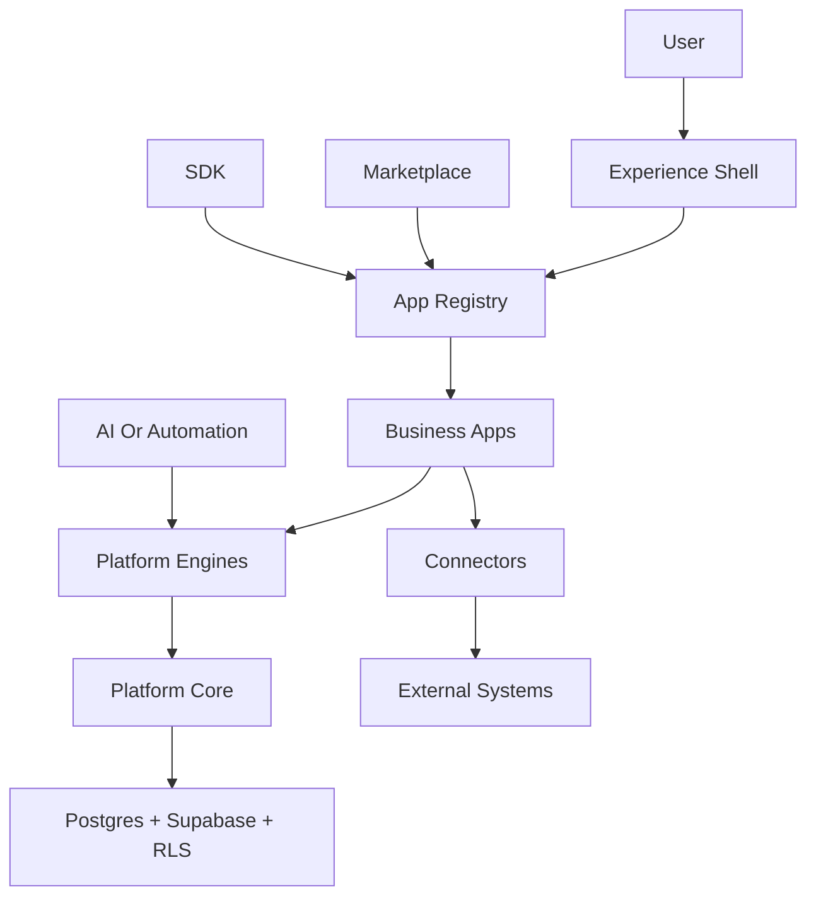
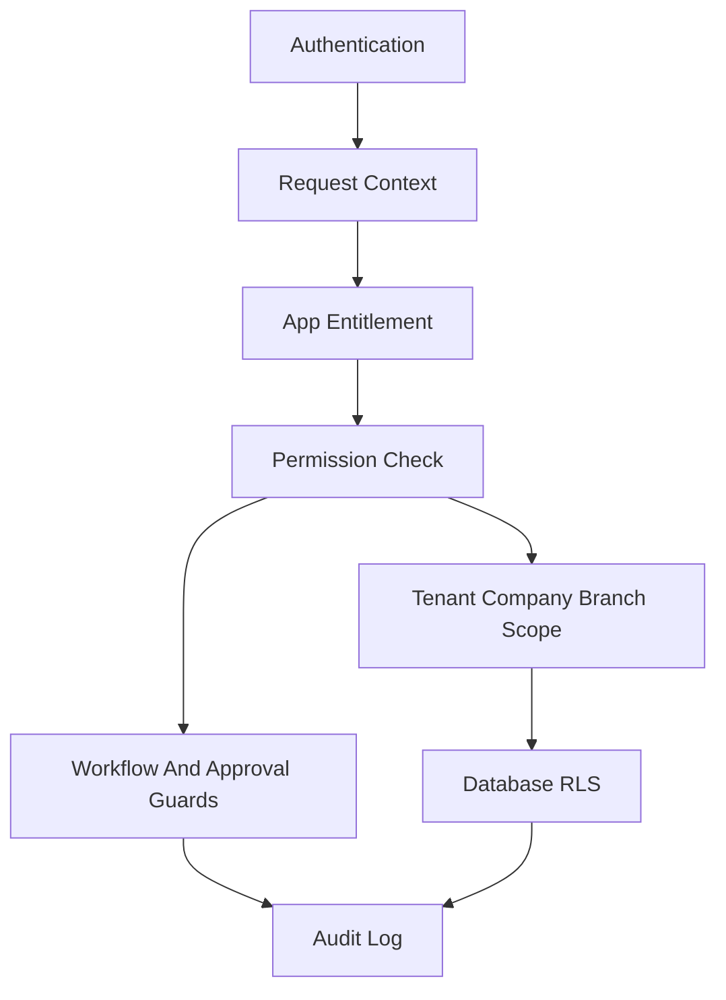

# Platform Blueprint

This document captures the approved Nexora Platform Blueprint. It must not be redesigned through implementation work. Changes require an update to `docs/platform` first.

## Target Shape

Nexora uses a modular monolith in one Next.js App Router project. The platform layer owns reusable runtime and engine contracts. Business apps consume those contracts through public APIs and must not import private platform internals.

## Platform Core

Platform Core is the neutral runtime every app, engine, connector, automation, and AI action depends on. It must not contain business domain logic.

Responsibilities:

- Identity, session, tenant, company, branch, employee, and experience context.
- RBAC, entitlements, data scopes, permission metadata, and segregation of duties.
- App registry, app installation state, feature flags, settings, localization, theme, observability, logging, error normalization, feedback, and audit foundation.
- Server-only data access boundaries and service-role governance.
- Runtime contracts for apps, engines, connectors, SDK clients, AI actions, and background workers.

Non-responsibilities:

- Inventory rules, purchasing lifecycle, manufacturing execution, HR payroll, accounting posting, sales tax logic, or other business-specific behavior.

## Platform Engines

Engines are reusable domain-neutral capabilities consumed by apps through stable contracts:

- Workflow Engine.
- Approval Engine.
- Universal Document Lifecycle and Numbering Engine.
- Notification Engine.
- Universal Search Engine.
- Reporting Engine and Universal Report Builder.
- Printing Engine and Print Template Designer.
- Import/Export Engine.
- Background Jobs and Outbox Engine.
- Automation and AI Governance Engine.
- Cost Engine.
- Universal Dashboard Builder.
- File Engine.
- Integration and Connector Engine.
- Audit and Observability Engine.
- Testing Engine and Quality Gates.

## Business Apps

Business apps are installable modules. They own their business language, tables, permissions, statuses, workflows, services, routes, UI, reports, prints, tests, and integration contracts.

Official app contract:

- Manifest: key, name, version, category, access experiences, permissions, statuses, dependencies, navigation, commands, reports, prints, dashboards, settings, feature flags, and data classification.
- Public API: stable application contracts only, not repositories or private infrastructure.
- Route adapters: app routes, actions, and loaders through platform-recognized contracts.
- Data ownership: app-owned schema is scoped by tenant, company, branch, and employee where required.
- Lifecycle hooks: install, enable, disable, upgrade, configure, health-check, archive, and export.

## App Registry And Lifecycle

The App Registry is the runtime source of truth for what apps exist, what a tenant has installed, what dependencies are satisfied, and what a user can see or do.

Lifecycle states:

- Available.
- Installed.
- Enabled.
- Suspended.
- Archived.
- Upgrading.

Rules:

- Navigation, commands, reports, prints, dashboards, automations, connectors, and settings derive from registry plus permissions.
- Dependencies are declared and checked before enablement.
- Disable or uninstall must never silently destroy business records.

## Navigation Philosophy

Nexora is not a single global sidebar ERP. Navigation is intent-based and app-aware:

- App Launcher for installed apps.
- Topbar for workspace, company, branch, search, command palette, notifications, help, and user menu.
- Contextual Sidebar for the current app.
- Command Palette for create, search, navigate, approve, post, print, export, switch app, and run automation actions.
- Quick Actions on dashboards, record pages, and command palette.
- Mobile compact navigation with searchable commands and touch-friendly patterns.

## Security Model

Security layers:

- Authentication verifies identity.
- Request context resolves user, tenant, company, branch, employee, experience, locale, timezone, actor type, and correlation ID.
- Entitlements decide whether a tenant can use an app.
- Permissions decide allowed actions.
- Data scopes decide which rows the actor can access.
- RLS enforces tenant, company, branch, and employee isolation at the database layer.
- Application services enforce business rules, workflow, approval, and idempotency.
- Audit records sensitive actions and administrative changes.

## Data Architecture

Data is owned by apps and protected by platform rules.

Ownership levels:

- Global reference: rare public data that is not tenant-private.
- Tenant-owned: private business records include `tenant_id`.
- Company-owned: legal and financial records include `company_id`.
- Branch-scoped: operational records include `branch_id` or explicit source/destination branch scope.
- Employee-owned: portal and self-service records include employee scope.

## Non-Negotiable Decisions

- Platform Core must not import business app code.
- Business apps consume engines instead of reimplementing shared capabilities.
- App navigation is registry-driven, not hardcoded.
- Tenant, company, branch, employee, and experience context is explicit.
- RLS and application authorization are both required.
- Heavy reports, exports, printing, integrations, imports, and AI execution are background-capable workloads.
- Raw UUID-first UX is not acceptable for production workflows.
- Tests are required for RLS, permissions, workflows, app lifecycle, and high-risk business rules before production readiness.
