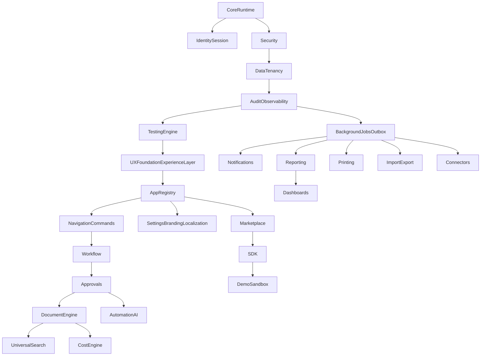

# Implementation Roadmap

This roadmap is platform-only. No business apps should be built until the mandatory platform runtime, identity/session access, security model, app registry, navigation system, data layer, UX foundation, and required core engines are in place.

Business apps must later consume platform services through public contracts. They must not implement their own auth, tenancy, permissions, experience shells, UX primitives, company branding, navigation, workflow, approvals, document lifecycle, report builders, print designers, search, import/export, audit, notifications, files, cost logic, dashboards, testing harnesses, or automation foundations.

## Phase 1: Platform Core Runtime

Priority: Critical.

Purpose: establish the runtime foundation every app, engine, connector, automation, and AI action depends on.

Core contracts: `RequestContext`, `ActorContext`, `PlatformError`, `PlatformResult`, `Logger`, `CorrelationId`, server/client boundary contracts, and platform feedback contracts.

Exit gate:

- Every server entry point can resolve one explicit context object.
- Root platform services do not depend on business apps.
- Context supports ERP, portal, connector, automation, AI, and system actors.

## Phase 2: Identity, Session, And Experience Access

Priority: Critical.

Purpose: make authentication and experience access a platform service rather than an assumed token or header convention.

Core contracts: `getCurrentUser()`, `requireCurrentUser()`, `resolveSessionContext()`, `requireExperienceAccess()`, `resolveExperienceContext()`, tenant/company/branch selection, and profile resolution.

Exit gate:

- Platform distinguishes authenticated identity, tenant membership, company/branch scope, and experience access.
- Portal-only users cannot load ERP runtime metadata.
- Every platform request carries explicit experience context before reaching apps or engines.

## Phase 3: Security Foundation

Priority: Critical.

Purpose: establish the enterprise security model before apps and engines rely on it.

Core contracts: `PermissionKey`, `PermissionDefinition`, `RoleDefinition`, `AssignmentScope`, `EntitlementCheck`, `DataScope`, `requirePermission()`, `hasPermission()`, `requireEntitlement()`, `requireDataScope()`, and segregation-of-duties checks.

Exit gate:

- No platform action depends on UI-only authorization.
- Permission checks are centralized.
- Permission definitions include metadata needed by navigation, reporting, printing, workflow, approvals, and audit.

## Phase 4: Data Layer And Tenancy Model

Priority: Critical.

Purpose: define the official data foundation and RLS model before apps create business tables.

Core contracts: `TenantId`, `CompanyId`, `BranchId`, `EmployeeId`, `DataOwnershipScope`, `MigrationPolicy`, `RlsPolicyTemplate`, `RepositoryContext`, `PaginatedQuery`, and `CursorPage`.

Exit gate:

- Official tenant/company/branch model is closed.
- RLS regression testing is automated.
- Repository conventions require scoped access.
- Query and index standards are defined before business app schemas are accepted.

## Phase 5: Audit And Observability Engine

Priority: Critical.

Purpose: make sensitive actions traceable and operational health measurable from the beginning.

Core contracts: `AuditEvent`, `AuditAction`, `AuditActor`, `AuditSubject`, `recordAuditEvent()`, `recordSecurityAudit()`, `recordSystemAudit()`, `TelemetryEvent`, and `PlatformLogger`.

Exit gate:

- All security-sensitive platform operations have audit contracts.
- Audit supports user, service, integration, automation, and AI actors.
- Audit records are tenant-scoped and tamper-resistant in normal flows.

## Phase 5B: Testing Engine And Quality Gates

Priority: Critical.

Purpose: establish reusable platform testing infrastructure before apps are built.

Core contracts: test tenant/user/role factories, RLS scenarios, permission scenarios, workflow scenarios, approval scenarios, performance budgets, E2E flow definitions, and platform test context helpers.

Exit gate:

- Platform provides reusable test contexts and scenario builders.
- RLS, permission, workflow, approval, and performance tests are mandatory gates for relevant engines and apps.
- Business apps cannot be production-ready without passing the platform test harness.

## Phase 6A: UX Foundation And Experience Layer

Priority: Critical.

Purpose: establish the official Nexora user experience foundation before app screens, dashboards, documents, reports, and workflows are built.

Core contracts: `ExperienceDefinition`, `ExperienceShell`, `ExperienceContext`, `UxPattern`, `DesignToken`, `ResponsiveLayoutPolicy`, `AccessibilityPolicy`, `CompanyBrandingContext`, `LookupInteraction`, `defineExperience()`, `getExperienceShell()`, `getUxPolicy()`, and `resolveBrandingContext()`.

Exit gate:

- Every future app can consume one official experience shell and UX policy.
- Mobile, accessibility, RTL/LTR, theme, and branding requirements are defined before app UI work.
- Lookup/search-first data entry is the default for business workflows.

## Phase 6: App Registry And Entitlements

Priority: Critical.

Purpose: make Nexora App First. Apps become installable, governable, visible, and lifecycle-managed platform units.

Core contracts: `AppManifest`, `AppCapability`, `AppDependency`, `InstalledApp`, `AppEntitlement`, `AppLifecycleState`, `registerApp()`, `listAvailableApps()`, `listInstalledApps()`, `requireAppEntitlement()`, and `getAppCapabilities()`.

Exit gate:

- Navigation, commands, reports, prints, dashboards, and settings can be discovered from app metadata.
- Apps can be enabled or disabled without code changes.
- App dependencies are explicit and validated.

## Phase 7: Navigation, Command, And Action System

Priority: Critical.

Purpose: make Nexora UX First and easy to use through intent-based navigation.

Core contracts: `NavigationContribution`, `AppLauncherItem`, `SidebarSection`, `CommandDefinition`, `QuickActionDefinition`, `NavigationContext`, `getNavigationForContext()`, `getCommandsForContext()`, and `executeCommand()`.

Exit gate:

- Navigation is generated from app registry, entitlements, permissions, experience, company, branch, and user preferences.
- Commands are permission-checked server-side.
- Mobile navigation strategy is defined before app UI expands.

## Phase 8: Settings, Feature Flags, Preferences, Localization, Theme, And Company Branding

Priority: High.

Purpose: provide cross-app configuration and personalization without app-specific configuration shortcuts.

Core contracts: `SettingKey`, `SettingScope`, `FeatureFlag`, `UserPreference`, `LocalizationContext`, `CompanyBranding`, `BrandingScope`, `Formatters`, `getSetting()`, `setSetting()`, `isFeatureEnabled()`, `getUserPreferences()`, `getCompanyBranding()`, and `resolveBrandingForOutput()`.

Exit gate:

- Apps declare settings and flags through manifests.
- Runtime resolves effective settings by scope.
- Locale and direction are part of request context and shell behavior.
- Company branding is reused by shells, dashboards, reports, print templates, and notifications.

## Phase 9: Workflow Engine

Priority: Critical for production apps.

Purpose: prevent every app from implementing its own status transition logic.

Exit gate:

- Apps define workflows through registered definitions.
- Status transitions are no longer arbitrary service updates.
- Workflow history is persisted and auditable.

## Phase 10: Approval Engine

Priority: Critical for production apps with sensitive workflows.

Purpose: provide reusable approval policies and decision flows for all apps.

Exit gate:

- Approval decisions cannot be made without policy, scope, permission, and audit.
- Approval Engine integrates with Workflow Engine.

## Phase 11: Universal Document Lifecycle, Numbering, Timeline, Comments, And Files Engine

Priority: Critical for document-based production apps.

Purpose: give apps a shared document lifecycle instead of local document shells, numbers, attachments, comments, approvals, timelines, and official-output rules.

Exit gate:

- Apps can create documents without implementing their own numbering, timeline, comments, or attachment infrastructure.
- Official number generation is transaction-safe.
- Document-based apps use universal lifecycle commands instead of direct status updates.

## Phase 12: Universal Search Engine

Priority: High, mandatory before UX-complete production apps.

Purpose: make search a central navigation and productivity surface across apps.

Exit gate:

- Apps register searchable entities instead of implementing isolated search boxes.
- Search is permission-filtered and performance-reviewed.

## Phase 13: Notification Engine

Priority: High.

Purpose: provide reusable communication for workflows, approvals, automations, connectors, and user activity.

Exit gate:

- Apps and engines can enqueue notifications without owning delivery infrastructure.

## Phase 14: Reporting Engine And Universal Report Builder

Priority: Critical for production apps with reporting needs.

Purpose: make reports controlled platform workloads and provide a universal report builder instead of browser data dumps or app-specific report screens.

Exit gate:

- Large reports run asynchronously.
- Report permissions distinguish view, export, print, sensitive columns, cross-branch, and cross-company access.
- Apps expose report datasets and definitions through the universal builder contract.

## Phase 15: Printing Engine And Print Template Designer

Priority: Critical for production apps with official documents.

Purpose: provide official document rendering, snapshots, templates, a print template designer, batch printing, and reprint audit.

Exit gate:

- Official documents can be rendered from stable snapshots and template versions.
- Reprints are permission-checked and audited.
- Apps use the platform print template designer contract instead of local print layouts.

## Phase 16: Background Jobs, Outbox, And Async Processing

Priority: Critical.

Purpose: separate heavy and retryable workloads from interactive requests.

Exit gate:

- Retryable and heavy platform workloads have a standard job/outbox path.
- Jobs carry tenant, actor, permission, correlation, and idempotency context.

## Phase 17: Import And Export Engine

Priority: High.

Purpose: provide governed data movement without app-specific import/export shortcuts.

Exit gate:

- Apps define import/export capabilities through the platform, not custom buttons or direct database writes.

## Phase 18: Integration And Connector Engine

Priority: High.

Purpose: support external systems without compromising core security and data integrity.

Exit gate:

- Connectors use platform identities, scoped permissions, audit, idempotency, and failure recovery.

## Phase 19: Cost Engine

Priority: Critical before production inventory, purchasing, manufacturing, sales, or accounting apps.

Purpose: centralize costing and valuation logic so apps do not create incompatible financial facts.

Exit gate:

- Production operational apps that affect stock or finance cannot launch without a cost policy integration path.

## Phase 20: Universal Dashboard Builder And Analytics Surface

Priority: Medium-High.

Purpose: provide role-aware workspaces, KPIs, operational summaries, and a universal dashboard builder without every app building custom dashboards.

Exit gate:

- Apps register widgets and dashboard contributions through platform contracts.
- Users compose dashboards only from permission-filtered, governed widget definitions.

## Phase 21: Automation And AI Governance Engine

Priority: High before AI or advanced automation ships.

Purpose: allow automation and AI assistance without bypassing enterprise controls.

Exit gate:

- AI and automation operate only through platform-approved, permission-checked, auditable actions.

## Phase 22: Marketplace And App Store Foundation

Priority: Medium before third-party or tenant-installable apps.

Purpose: provide the catalog, certification, and install experience for apps and connectors.

Exit gate:

- Marketplace can list and request apps without bypassing app lifecycle and entitlements.

## Phase 23: SDK And Developer Platform

Priority: High before multiple app teams or external apps.

Purpose: give developers a governed way to build apps, connectors, commands, reports, prints, workflows, automations, and dashboards.

Exit gate:

- Apps can be authored using SDK contracts without importing platform internals.

## Phase 24: Demo And Sandbox Mode

Priority: Medium, mandatory before sales demos and training at scale.

Purpose: support safe demos, training, partner exploration, and AI examples without weakening production paths.

Exit gate:

- Demo mode is isolated, auditable, resettable, and cannot alter production paths.

## Mandatory Engines Before First Production Business App

The first production-ready business app must not launch until these are complete:

- Platform Core Runtime.
- Identity, Session, and Experience Access.
- Security Foundation.
- Data Layer and Tenancy Model.
- Audit and Observability Engine.
- Testing Engine and Quality Gates.
- UX Foundation and Experience Layer.
- App Registry and App Lifecycle.
- Navigation, Command, and Action System.
- Settings, Feature Flags, Preferences, Localization, Theme, and Company Branding.
- Workflow Engine.
- Approval Engine if the app has approval-sensitive actions.
- Universal Document Lifecycle, Numbering, Timeline, Comments, and Files Engine if the app creates business documents.
- Universal Search Engine for production UX readiness.
- Background Jobs and Outbox for retryable or heavy workloads.
- Reporting Engine and Universal Report Builder if the app exposes reports.
- Printing Engine and Print Template Designer if the app prints official documents.
- Universal Dashboard Builder if the app contributes dashboards, KPIs, or workspaces.
- Cost Engine before any app affects stock, manufacturing, purchasing valuation, sales COGS, or accounting.
- Import/Export Engine if the app imports or exports records.
- Notification Engine if the app emits workflow, approval, or operational notifications.

## Recommended Phase Order

## Platform Design Freeze Enforcement

During Platform Design Freeze:

- No new business app implementation.
- No HR, manufacturing, inventory, CRM, sales, accounting, POS, rental, or marketplace business workflows.
- Existing business modules may only be touched if required to extract or protect platform contracts.
- All work should reduce future app duplication and strengthen reusable platform engines.
- Every implementation proposal must identify which platform component or engine it belongs to and which public contract it stabilizes.
